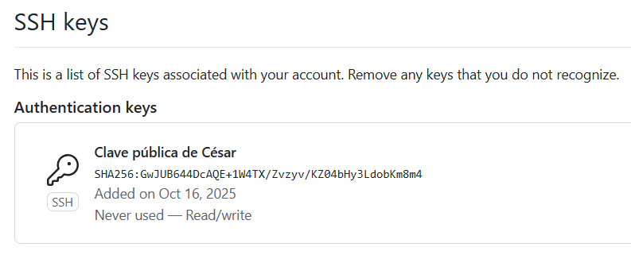

Ejercicio 1:

Apartado 1:

```bash
Añadimos un segundo adaptador de red al Ubuntuserver con "Solo anfitrión"
```

Apartado 2:

Nos conectamos a Ubuntuserver desde la nativa:
```bash
PS C:\Users\cesar> ssh cesar@192.168.56.101
cesar@192.168.56.101's password:
```

Vemos las ips:
```bash
cesar@crb-server:~$ ip a
1: lo: <LOOPBACK,UP,LOWER_UP> mtu 65536 qdisc noqueue state UNKNOWN group default qlen 1000
    link/loopback 00:00:00:00:00:00 brd 00:00:00:00:00:00
    inet 127.0.0.1/8 scope host lo
       valid_lft forever preferred_lft forever
    inet6 ::1/128 scope host noprefixroute
       valid_lft forever preferred_lft forever
2: enp0s3: <BROADCAST,MULTICAST,UP,LOWER_UP> mtu 1500 qdisc fq_codel state UP group default qlen 1000
    link/ether 08:00:27:6f:15:5c brd ff:ff:ff:ff:ff:ff
    inet 192.168.56.101/24 metric 100 brd 192.168.56.255 scope global dynamic enp0s3
       valid_lft 591sec preferred_lft 591sec
    inet6 fe80::a00:27ff:fe6f:155c/64 scope link
       valid_lft forever preferred_lft forever
3: enp0s8: <BROADCAST,MULTICAST,UP,LOWER_UP> mtu 1500 qdisc fq_codel state UP group default qlen 1000
    link/ether 08:00:27:dd:be:6b brd ff:ff:ff:ff:ff:ff
    inet 10.0.2.15/24 metric 100 brd 10.0.2.255 scope global dynamic enp0s8
       valid_lft 86090sec preferred_lft 86090sec
    inet6 fd00::a00:27ff:fedd:be6b/64 scope global dynamic mngtmpaddr noprefixroute
       valid_lft 86094sec preferred_lft 14094sec
    inet6 fe80::a00:27ff:fedd:be6b/64 scope link
       valid_lft forever preferred_lft forever
```

La IP del nuevo adaptador es 192.168.56.101 asignada por VirtualBox. Dicha IP es con la que nos conectamos desde nuestra máquina nativa. La IP del adaptador de red en NAT es 10.0.2.15

Apartado 3:

Habiendo hecho lo siguiente con éxito se ha demostrado la conectividad:
```bash
PS C:\Users\cesar> ssh cesar@192.168.56.101
cesar@192.168.56.101's password:
```
Se conectó con éxito.

Apartado 4:

Hacemos lo siguiente:
```bash
cesar@crb-server:~$ sudo nano /etc/hosts
```

Cambiamos:
```bash
127.0.1.1 crb_server
```

Y comprobamos:
```bash
cesar@crb-server:~$ hostnamectl
 Static hostname: crb-server
```

Resulta que la _ es un caracter no permitido. Nos quedamos con el guión.

Apartado 5:

Vamos a C:\Windows\System32\drivers\etc , ejecutamos el bloc de notas como administrador, abrimos el archivo hosts y allí añadimos:
```bash
192.168.56.101 crb-server
```
Y ya nuestro equipo resuelve localmente la IP de nuestro ubuntuserver por su nombre.

Comprobamos su funcionamiento:
```bash
PS C:\Users\cesar> ping crb-server

Haciendo ping a crb-server [192.168.56.101] con 32 bytes de datos:
Respuesta desde 192.168.56.101: bytes=32 tiempo=1ms TTL=64
Respuesta desde 192.168.56.101: bytes=32 tiempo<1m TTL=64
Respuesta desde 192.168.56.101: bytes=32 tiempo<1m TTL=64
```
Funciona correctamente.

Ejercicio 2:

Apartado 1:

Creo el usuario:

```bash
cesar@crb-server:~$ sudo useradd -m -s /bin/bash crb_server
[sudo] password for cesar:
cesar@crb-server:~$ sudo passwd crb_server
New password:
Retype new password:
passwd: password updated successfully
cesar@crb-server:~$
```

Apartado 2:

Compruebo que puedo conectarme con ssh y contraseña con el usuario creado desde el cliente:

```bash
cesar@crb-server:~$ exit
logout
Connection to 192.168.56.101 closed.
PS C:\Users\cesar> ssh crb_server@192.168.56.101
crb_server@192.168.56.101's password:
Welcome to Ubuntu 24.04.3 LTS (GNU/Linux 6.8.0-71-generic x86_64)
crb_server@crb-server:~$
```
Estoy conectado mediante ssh y contraseña con el nuevo usuario exitosamente.

Apartado 3:

Son tres pasos. 
Primero generamos un par de claves pública/privada en el cliente:

```bash
PS C:\Users\cesar> ssh-keygen -b 1024
Generating public/private ed25519 key pair.
Enter file in which to save the key (C:\Users\cesar/.ssh/id_ed25519):
Enter passphrase (empty for no passphrase):
Enter same passphrase again:
Your identification has been saved in C:\Users\cesar/.ssh/id_ed25519
Your public key has been saved in C:\Users\cesar/.ssh/id_ed25519.pub
The key fingerprint is:
SHA256:GwJUB644DcAQE+1W4TX/Zvzyv/KZ04bHy3LdobKm8m4 cesar@LenovoI7
The key's randomart image is:
+--[ED25519 256]--+
|O+  oo=..        |
| +.o.o +         |
| ...o . .        |
|  o+ o   o       |
| .o o . S =      |
|   .   . = .   . |
|        . . . .++|
|       . E =.o++B|
|        =+o.++OB.|
+----[SHA256]-----+
PS C:\Users\cesar>
```
Las claves se guardan en el directorio ~/.ssh

```bash
PS C:\Users\cesar\.ssh> ls


    Directorio: C:\Users\cesar\.ssh


Mode                 LastWriteTime         Length Name
----                 -------------         ------ ----
-a----        16/10/2025     13:25            411 id_ed25519
-a----        16/10/2025     13:25             97 id_ed25519.pub
-a----        25/09/2025     13:20           1683 known_hosts
-a----        25/09/2025     13:20            937 known_hosts.old


PS C:\Users\cesar\.ssh>
```
En este directorio se ven dos ficheros, uno que contiene la clave pública (id_ed25519.pub) y el otro con la clave privada (id_ed25519)

Segundo debemos enviar el archivo de clave pública al servidor mediante el comando scp:

```bash
PS C:\Users\cesar\.ssh> scp .\id_ed25519.pub crb_server@192.168.56.101:~
crb_server@192.168.56.101's password:
id_ed25519.pub                                                                        100%   97    15.8KB/s   00:00
PS C:\Users\cesar\.ssh>
```
Ahora vemos en la máquina de destino el fichero de la clave:

```bash
crb_server@crb-server:~$ ls
id_ed25519.pub
```
Ahí se encuentra la clave pública.

Ahora introducimos el contenido del fichero de la clave pública en el authorized keys:
(creamos el fichero .ssh en el directorio del usuario si no existía)
```bash
crb_server@crb-server:~$ mkdir .ssh
crb_server@crb-server:~$ cat id_ed25519.pub >> ./.ssh/authorized_keys
crb_server@crb-server:~$
```

Ahora podemos acceder sin contraseña:

```bash
PS C:\Users\cesar\.ssh> ssh crb_server@192.168.56.101
Welcome to Ubuntu 24.04.3 LTS (GNU/Linux 6.8.0-71-generic x86_64)

 * Documentation:  https://help.ubuntu.com
 * Management:     https://landscape.canonical.com
 * Support:        https://ubuntu.com/pro

 System information as of jue 16 oct 2025 11:37:22 UTC

  System load:             0.02
  Usage of /:              24.4% of 19.51GB
  Memory usage:            8%
  Swap usage:              0%
  Processes:               97
  Users logged in:         1
  IPv4 address for enp0s8: 10.0.2.15
  IPv6 address for enp0s8: fd00::a00:27ff:fedd:be6b


El mantenimiento de seguridad expandido para Applications está desactivado

Se pueden aplicar 0 actualizaciones de forma inmediata.

Active ESM Apps para recibir futuras actualizaciones de seguridad adicionales.
Vea https://ubuntu.com/esm o ejecute «sudo pro status»


The list of available updates is more than a week old.
To check for new updates run: sudo apt update
Failed to connect to https://changelogs.ubuntu.com/meta-release-lts. Check your Internet connection or proxy settings


Last login: Thu Oct 16 11:32:36 2025 from 192.168.56.1
crb_server@crb-server:~$
```

Ahora, por seguridad, podemos acceder al fichero de configuración del servidor sshd_config (el susuario debe ser "sudoer"):

```bash
cesar@crb-server:~$ sudo nano /etc/ssh/sshd_config
```

Y cambiar lo siguiente (de yes a no):

```bash
PasswordAuthentication no
```

Ejercicio 3:

Hecho:

