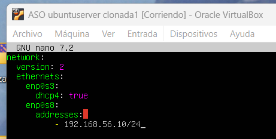
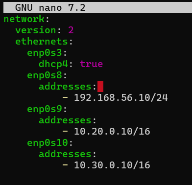
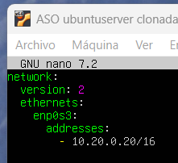
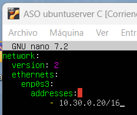
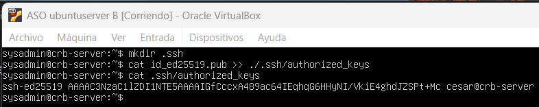
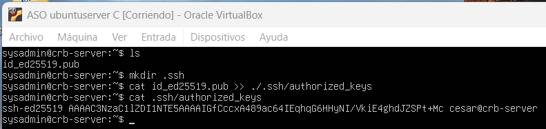

Lo primero es tener 2 máquinas ubuntuserver.
Los adaptadores son:
Para la máquina de enmedio, NAT - Solo anfitrion - Red interna - Red interna
Para cada una de las dos máquinas extremo, un solo red interna.

Vamos a la máquina de enmedio, entramos y hacemos:

```bash
sudo nano /etc/netplan/50-cloud-init.yaml
```

Cambiamos:



Hacemos sudo netplan apply para comprobar que funciona.

Vamos a añadir las IPs de las 2 máquinas de los extremos.

Volviendo a hacer

```bash
sudo nano /etc/netplan/50-cloud-init.yaml
```

Cambiamos:



Con ip vemos que tenemos las IPs configuradas bien:

```bash
cesar@crb-server:~$ ip a
1: lo: <LOOPBACK,UP,LOWER_UP> mtu 65536 qdisc noqueue state UNKNOWN group default qlen 1000
    link/loopback 00:00:00:00:00:00 brd 00:00:00:00:00:00
    inet 127.0.0.1/8 scope host lo
       valid_lft forever preferred_lft forever
    inet6 ::1/128 scope host noprefixroute
       valid_lft forever preferred_lft forever
2: enp0s3: <BROADCAST,MULTICAST,UP,LOWER_UP> mtu 1500 qdisc fq_codel state UP group default qlen 1000
    link/ether 08:00:27:6f:15:5c brd ff:ff:ff:ff:ff:ff
    inet 10.0.2.15/24 metric 100 brd 10.0.2.255 scope global dynamic enp0s3
       valid_lft 86396sec preferred_lft 86396sec
    inet6 fd00::a00:27ff:fe6f:155c/64 scope global dynamic mngtmpaddr noprefixroute
       valid_lft 86396sec preferred_lft 14396sec
    inet6 fe80::a00:27ff:fe6f:155c/64 scope link
       valid_lft forever preferred_lft forever
3: enp0s8: <BROADCAST,MULTICAST,UP,LOWER_UP> mtu 1500 qdisc fq_codel state UP group default qlen 1000
    link/ether 08:00:27:dd:be:6b brd ff:ff:ff:ff:ff:ff
    inet 192.168.56.10/24 brd 192.168.56.255 scope global enp0s8
       valid_lft forever preferred_lft forever
    inet6 fe80::a00:27ff:fedd:be6b/64 scope link
       valid_lft forever preferred_lft forever
4: enp0s9: <BROADCAST,MULTICAST,UP,LOWER_UP> mtu 1500 qdisc fq_codel state UP group default qlen 1000
    link/ether 08:00:27:d8:e3:03 brd ff:ff:ff:ff:ff:ff
    inet 10.20.0.10/16 brd 10.20.255.255 scope global enp0s9
       valid_lft forever preferred_lft forever
    inet6 fe80::a00:27ff:fed8:e303/64 scope link
       valid_lft forever preferred_lft forever
5: enp0s10: <BROADCAST,MULTICAST,UP,LOWER_UP> mtu 1500 qdisc fq_codel state UP group default qlen 1000
    link/ether 08:00:27:d2:b7:f5 brd ff:ff:ff:ff:ff:ff
    inet 10.30.0.10/16 brd 10.30.255.255 scope global enp0s10
       valid_lft forever preferred_lft forever
    inet6 fe80::a00:27ff:fed2:b7f5/64 scope link
       valid_lft forever preferred_lft forever
```

Ahora nos vamos a una de las máquinas de los extremos:

Hacemos sudo adduser sysadmin y lo añadimos.

Vamos a su fichero:

```bash
sudo nano /etc/netplan/50-cloud-init.yaml
```

Y añadimos:



Hacemos sudo netplan apply y comprobamos con un ping que está conectada.

Ahora vamos a la máquina de Server-C.

Creamos el sysadmin.

Ahora entramos a su fichero:

```bash
sudo nano /etc/netplan/50-cloud-init.yaml
```

Para hacer que su adaptador red interna tenga la IP 10.30.0.20



Hacemos sudo netplan apply y comprobamos con un ping que está conectada.

Sólo puedo hacer ping a Server-C y Server-B desde Server-A y no desde mi Windows (Están en redes diferentes).

Ahora hay que enviar las claves públicas entre todo el mundo para que se autentiquen entre ellos.

Empiezo por mi Windows y mi Server-A.

Ya tengo par de claves generadas en Windows:

```bash
PS C:\Users\cesar\.ssh> ls


    Directorio: C:\Users\cesar\.ssh


Mode                 LastWriteTime         Length Name
----                 -------------         ------ ----
-a----        16/10/2025     13:25            411 id_ed25519
-a----        16/10/2025     13:25             97 id_ed25519.pub
-a----        22/10/2025     10:56           1779 known_hosts
-a----        25/09/2025     13:20            937 known_hosts.old


PS C:\Users\cesar\.ssh> cat id_ed25519.pub
ssh-ed25519 AAAAC3NzaC1lZDI1NTE5AAAAICjoJGfflVMnPXkenHAhr0FSTrEegmhXPCIQAQnH20Nn cesar@LenovoI7
PS C:\Users\cesar\.ssh>
```

Ahora enviamos el archivo de clave pública al servidor mediante el comando scp:

```bash
PS C:\Users\cesar\.ssh> scp .\id_ed25519.pub cesar@192.168.56.10:~
cesar@192.168.56.10's password:
id_ed25519.pub                                                                        100%   97    18.9KB/s   00:00
PS C:\Users\cesar\.ssh>
```

Ahora vemos en Server-A el fichero con la clave (en el usuario cesar)

```bash
cesar@crb-server:~$ ls
id_ed25519.pub  pr0201
cesar@crb-server:~$
```

Ahí se encuentra la clave pública.

Ahora introducimos el contenido del fichero de la clave pública en el authorized keys: (creamos el fichero .ssh en el directorio del usuario si no existía)

```bash
cesar@crb-server:~$ mkdir .ssh
cesar@crb-server:~$ cat id_ed25519.pub >> .ssh/authorized_keys
cesar@crb-server:~$ cat .ssh/authorized_keys
ssh-ed25519 AAAAC3NzaC1lZDI1NTE5AAAAICjoJGfflVMnPXkenHAhr0FSTrEegmhXPCIQAQnH20Nn cesar@LenovoI7
cesar@crb-server:~$
```

Ahí está mi clave pública. 

Ahora, por seguridad, podemos acceder al fichero de configuración del servidor sshd_config (el usuario debe ser “sudoer”):

```bash
cesar@crb-server:~$ sudo nano /etc/ssh/sshd_config
```

Y cambiar lo siguiente (de yes a no):

```bash
PasswordAuthentication no
```

Ahora podemos conectarnos desde el Windows al Server-A con el usuario cesar sin contraseña gracias a haber compartido la clave pública:

```bash
PS C:\Users\cesar> ssh cesar@192.168.56.10
Welcome to Ubuntu 24.04.3 LTS (GNU/Linux 6.8.0-71-generic x86_64)

 * Documentation:  https://help.ubuntu.com
 * Management:     https://landscape.canonical.com
 * Support:        https://ubuntu.com/pro

 System information as of mié 22 oct 2025 16:31:19 UTC

  System load:             0.01
  Usage of /:              24.9% of 19.51GB
  Memory usage:            8%
  Swap usage:              0%
  Processes:               96
  Users logged in:         1
  IPv4 address for enp0s3: 10.0.2.15
  IPv6 address for enp0s3: fd00::a00:27ff:fe6f:155c


El mantenimiento de seguridad expandido para Applications está desactivado

Se pueden aplicar 0 actualizaciones de forma inmediata.

Active ESM Apps para recibir futuras actualizaciones de seguridad adicionales.
Vea https://ubuntu.com/esm o ejecute «sudo pro status»


The list of available updates is more than a week old.
To check for new updates run: sudo apt update

Last login: Wed Oct 22 16:20:49 2025 from 192.168.56.1
cesar@crb-server:~$
```

Ahora debemos hacer lo mismo desde Server-A para Server-B y Server-C.

Para ello, debo generar un par de claves en Server A para enviar la pública a Server-B y a Server-C, y tras eso debo meter la clave pública dentro de .ssh/authorized_keys en Server-B y en Server-C.

Genero el par nuevo (desde Server-A):

```bash
cesar@crb-server:~$ ssh-keygen -b 1024
Generating public/private ed25519 key pair.
Enter file in which to save the key (/home/cesar/.ssh/id_ed25519):
Enter passphrase (empty for no passphrase):
Enter same passphrase again:
Your identification has been saved in /home/cesar/.ssh/id_ed25519
Your public key has been saved in /home/cesar/.ssh/id_ed25519.pub
The key fingerprint is:
SHA256:hOypLseRNRJgdU65mG50H4ptd+ysy8A2r27jWqY4rCg cesar@crb-server
The key's randomart image is:
+--[ED25519 256]--+
|  oo. o.         |
| .  .=..         |
|     ++..        |
|    =.=o.        |
|   o Bo+So       |
|    *o+ o o      |
| . o.oB. +       |
|E +oo=o=  o      |
|+..++=+o=o       |
+----[SHA256]-----+
cesar@crb-server:~$
```
Se ha guardado en /home/cesar/.ssh/id_ed25519

Ojo que el fichero id_ed25519.pub contiene la clave pública que acabo de generar mientras que dentro de authorized_keys está la clave pública generada anteriormente de Windows.

```bash
cesar@crb-server:~/.ssh$ ls
authorized_keys  id_ed25519  id_ed25519.pub  known_hosts  known_hosts.old
cesar@crb-server:~/.ssh$ cat authorized_keys
ssh-ed25519 AAAAC3NzaC1lZDI1NTE5AAAAICjoJGfflVMnPXkenHAhr0FSTrEegmhXPCIQAQnH20Nn cesar@LenovoI7
cesar@crb-server:~/.ssh$
```

La clave que debo enviar es la pública nueva que está en el fichero id_ed25519.pub

Para ello usamos el comando scp para enviar la clave a los sysadmin de Server-B y Server-C:

```bash
cesar@crb-server:~/.ssh$ scp ./id_ed25519.pub sysadmin@10.20.0.20:~
sysadmin@10.20.0.20's password:
id_ed25519.pub                                                                        100%   98    10.7KB/s   00:00
cesar@crb-server:~/.ssh$ scp ./id_ed25519.pub sysadmin@10.30.0.20:~
sysadmin@10.30.0.20's password:
id_ed25519.pub                                                                        100%   98     9.3KB/s   00:00
cesar@crb-server:~/.ssh$
```

Ahora vamos a Server-B y hago lo siguiente:



Ya tenemos la clave pública de Server-A en authorized_keys de Server-B.

Puedo entrar sin contraseña a Server-B:

```bash
cesar@crb-server:~$ ssh sysadmin@10.20.0.20
Welcome to Ubuntu 24.04.3 LTS (GNU/Linux 6.8.0-71-generic x86_64)

 * Documentation:  https://help.ubuntu.com
 * Management:     https://landscape.canonical.com
 * Support:        https://ubuntu.com/pro

 System information as of jue 23 oct 2025 11:03:21 UTC

  System load: 0.0                Memory usage: 9%   Processes:       97
  Usage of /:  23.7% of 19.51GB   Swap usage:   0%   Users logged in: 1


El mantenimiento de seguridad expandido para Applications está desactivado

Se pueden aplicar 0 actualizaciones de forma inmediata.

Active ESM Apps para recibir futuras actualizaciones de seguridad adicionales.
Vea https://ubuntu.com/esm o ejecute «sudo pro status»


The list of available updates is more than a week old.
To check for new updates run: sudo apt update
Failed to connect to https://changelogs.ubuntu.com/meta-release-lts. Check your Internet connection or proxy settings


Last login: Thu Oct 23 10:19:46 2025 from 10.20.0.10
sysadmin@crb-server:~$
```

Ahora hacemos exactamente lo mismo para Server-C al cual ya le habíamos enviado la clave pública nueva de Server-A:



Ya tenemos la clave pública de Server-A en authorized_keys de Server-C.

Puedo entrar sin contraseña a Server-C:

```bash
cesar@crb-server:~$ ssh sysadmin@10.30.0.20
Welcome to Ubuntu 24.04.3 LTS (GNU/Linux 6.8.0-71-generic x86_64)

 * Documentation:  https://help.ubuntu.com
 * Management:     https://landscape.canonical.com
 * Support:        https://ubuntu.com/pro

 System information as of jue 23 oct 2025 11:14:14 UTC

  System load: 0.0                Memory usage: 9%   Processes:       99
  Usage of /:  25.0% of 19.51GB   Swap usage:   0%   Users logged in: 1


El mantenimiento de seguridad expandido para Applications está desactivado

Se pueden aplicar 0 actualizaciones de forma inmediata.

Active ESM Apps para recibir futuras actualizaciones de seguridad adicionales.
Vea https://ubuntu.com/esm o ejecute «sudo pro status»


The list of available updates is more than a week old.
To check for new updates run: sudo apt update
Failed to connect to https://changelogs.ubuntu.com/meta-release-lts. Check your Internet connection or proxy settings


Last login: Thu Oct 23 10:23:28 2025 from 10.30.0.10
sysadmin@crb-server:~$
```

Ya tenemos conexión transparente en toda la red. (Yuju!!!)

Explica qué contienen y para qué sirven los siguientes ficheros relacionados con SSH:

```bash
~/.ssh/id_rsa y ~/.ssh/id_rsa.pub
```
Estos ficheros contienen la clave privada y clave pública respectivamente. Sirven para tenerlas almacenadas y/o transportarlas.

```bash
~/.ssh/authorized_keys
```
Este fichero contiene aquellas claves que el sistema comprobará automáticamente a la hora de hacer una autenticación. Al meter nuestra clave pública ahí, el sistema deja de pedir contraseña para autenticar: ya tenemos la clave pública para ello.

```bash
~/.ssh/known_hosts
```
Este fichero contiene los hosts que se han conectado al sistema anteriormente. Si un host nuevo intenta acceder sin estar registrado en el fichero, se llevan a cabo unas comprobaciones de seguridad y avisos y si finalmente accede queda registrado en el fichero para el futuro.

```bash
/etc/ssh/sshd_config
```
Este fichero contiene la configuración del sistema ssh que estamos usando. Aquí podemos cambiar cosas útiles como PubkeyAuthentication y PasswordAuthentication.

```bash
/var/log/auth.log
```
En este fichero hay un registro de lo sucedido anteriormente en el sistema, como logins, logouts, haber recibido una clave nueva, y mucho más.

```bash
/etc/hosts.allow y /etc/hosts/deny
```
En hosts.allow se encuentran los hosts que hemos permitido manualmente entrar al sistema guardándolos en dicho fichero.
En hosts.deny se encuentran los hosts que hemos denegado manualmente entrar al sistema guardándolos en dicho fichero.