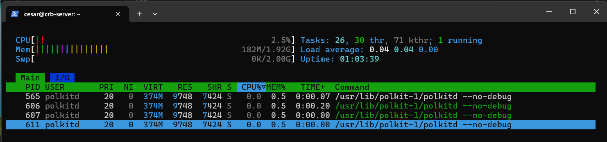

1->Exploración básica de procesos:

Abre una terminal y utiliza el comando ps para listar los procesos asociados a tu usuario. Anota el PID (Process ID) de al menos tres procesos.

Sólo tengo 2 procesos asociados a mi usuario usando ps:
```bash
cesar@crb-server:~$ ps
    PID TTY          TIME CMD
   1035 pts/0    00:00:00 bash
   1046 pts/0    00:00:00 ps
```

Usa el comando ps aux para listar todos los procesos del sistema. Identifica y anota el PID de un proceso que no pertenezca a tu usuario.

```bash
cesar@crb-server:~$ ps aux
USER     PID %CPU %MEM    VSZ   RSS TTY      STAT START   TIME COMMAND
root       1  0.5  0.6  22032 13216 ?        Ss   07:17   0:01 /sbin/init
```

Responde a las siguientes preguntas:

¿Qué diferencia hay entre el comando ps y ps aux?

El comando ps sólo muestra los procesos asociados al usuario que lo ejecuta, mientras que ps aux muestra TODOS los procesos.

Cuando decimos que un proceso pertenece a un usuario, ¿qué implicaciones tiene? Es decir, ¿en qué afecta eso al proceso?

En que el propietario del proceso es el usuario en cuestión, y no el root u otra entidad. Por tanto el proceso fue iniciado por ese usuario (o por un programa que él ejecutó) y hereda su identidad y privilegios dentro del sistema operativo.

2->Monitorización de procesos en tiempo real:

Utiliza el comando top para monitorizar los procesos en tiempo real. Identifica el proceso que consume más CPU y anota su PID.

```bash
cesar@crb-server:~$ top
PID USER      PR  NI    VIRT    RES    SHR S  %CPU  %MEM     TIME+ COMMAND
148 root       0 -20       0      0      0 I   1,0   0,0   0:00.04 kworker/0:2H-kblock
```

Cambia la visualización de top para ordenar los procesos por uso de memoria (tecla M). Anota el nombre del proceso que consume más memoria.

```bash
PID USER      PR  NI    VIRT    RES    SHR S  %CPU  %MEM     TIME+ COMMAND
  1 root      20   0   22032  13216   9504 S   0,0   0,7   0:01.81 systemd
```

Responde a las siguientes preguntas:

¿Qué columnas de información se muestran en top y cuál es su significado?

PID: Número de identificación del proceso.

USER: Propietario del proceso.

PR (Priority): Prioridad del proceso (Número más bajo = mayor prioridad)

NI (Nice Value): Valor de prioridad que el usuario puede establecerle al proceso.

VIRT (Memoria virtual total): Cantidad total de memoria que el proceso puede acceder.

RES (Memoria residente): Cantidad de memoria RAM que realmente está usando el proceso en ese momento.

SHR (Memoria compartida): Parte de la memoria residente que se comparte con otros procesos.

S (State): Estado del proceso: 
R = Running (ejecutando)
S = Sleeping (durmiendo)
D = Waiting (espera ininterrumpible)
T = Stopped
Z = Zombie.

%CPU: Porcentaje de uso de la CPU. Con varios núcleos puede superar el 100%.

%MEM: Porcentaje de la memoria física total del sistema que está usando el proceso.

TIME+: Tiempo acumulado que el proceso ha consumido en CPU desde que se inició.

COMMAND: Nombre del programa o comando que inició el proceso.

¿Cómo puedes cambiar el intervalo de actualización de top?

Con la opción interactiva d.

También usando el comando top -d (Tiempo de actualización deseado en segundos)

Al usar d:

```bash
Change delay from 3,0 to 3,5
```

3->Detener y reanudar procesos:

Ejecuta el comando sleep 300 & para crear un proceso en segundo plano que duerma durante 300 segundos.

```bash
cesar@crb-server:~$ sleep 300 &
[1] 1115
cesar@crb-server:~$
```

Usa el comando jobs para listar los trabajos en segundo plano. Anota el ID del trabajo.

```bash
cesar@crb-server:~$ jobs
[1]+  Running                 sleep 300 &
cesar@crb-server:~$
```
El PID es 1115, lo vimos antes.

Detén el proceso usando el comando kill con la señal SIGSTOP. Verifica que el proceso esté detenido.

```bash
cesar@crb-server:~$ kill -20 1115
cesar@crb-server:~$ ps -auxw
cesar       1115  0.0  0.1   5684  2048 pts/0    T    07:48   0:00 sleep 300
```
El proceso tiene la T en Status, que indica que ha sido parado.

Reanuda el proceso usando el comando kill con la señal SIGCONT. Verifica que el proceso esté en ejecución nuevamente.

```bash
cesar@crb-server:~$ kill -18 1115
cesar@crb-server:~$ ps -auxw
[1]+  Done                    sleep 300
```
Para estas alturas el proceso ha concluido tras haberle dicho que continuara.

Responde a las siguientes preguntas:

¿Qué efecto tiene la señal SIGSTOP sobre un proceso?

La señal SIGSTOP detiene un proceso permitiendo que pueda seguir ejecutándose más tarde, es una pausa.

¿Cómo puedo verificar si un proceso está detenido o en ejecución?

Comprobando su Status con el comando ps. Tendrá una R si se está ejecutando o una T si está detenido.

4->Terminar procesos:

Crea un proceso en segundo plano con el comando sleep 600 &.

```bash
cesar@crb-server:~$ sleep 600 &
[1] 1171
cesar@crb-server:~$
```

Usa el comando ps para encontrar el PID del proceso sleep.

```bash
cesar@crb-server:~$ ps
PID TTY          TIME CMD
1171 pts/0    00:00:00 sleep
```
Su PID es 1171.

Termina el proceso usando el comando kill con la señal SIGTERM. Verifica que el proceso haya sido eliminado.

```bash
cesar@crb-server:~$ kill -15 1171
cesar@crb-server:~$ ps
[1]+  Terminated              sleep 600
```
Está terminated.

Responde a las siguientes preguntas:

¿Qué diferencia hay entre las señales SIGTERM y SIGKILL?

SIGTERM finaliza un proceso de una forma adecuada, mientras que SIGKILL mata forzosamente un proceso, parecido a mantener el botón de apagado de un ordenador.

¿Por qué es preferible utilizar SIGTERM antes que SIGKILL para terminar un proceso?

Porque apagar algo adecuadamente hace que sea menos probable que cause problemas o se estropee.

5->Prioridades de procesos:

Ejecuta el comando nice -n 10 sleep 300 & para crear un proceso con una prioridad baja.

```bash
cesar@crb-server:~$ nice -n 10 sleep 300 &
[1] 1179
cesar@crb-server:~$
```

Usa el comando ps -l para ver la prioridad (NI) del proceso. Anota el valor de NI.

```bash
cesar@crb-server:~$ ps -l
F S   UID     PID    PPID  C PRI  NI ADDR SZ WCHAN  TTY          TIME CMD
0 S  1000    1179    1035  0  90  10 -  1421 hrtime pts/0    00:00:00 sleep
```
NI = 10

Cambia la prioridad del proceso usando el comando renice. Establece la prioridad a 5 y verifica el cambio con ps -l.

```bash
cesar@crb-server:~$ sudo renice 5 -p 1179
[sudo] password for cesar:
1179 (process ID) old priority 10, new priority 5
cesar@crb-server:~$ ps -l
F S   UID     PID    PPID  C PRI  NI ADDR SZ WCHAN  TTY          TIME CMD
0 S  1000    1179    1035  0  85   5 -  1421 hrtime pts/0    00:00:00 sleep
```
Nuva prioridad establecida a 5.

Responde a las siguientes preguntas:

¿Para qué sirve el comando nice?

Para establecer la prioridad de un proceso del cual conocemos su PID.

¿Qué rango de valores puede tomar la prioridad (nice value) de un proceso y qué significa cada extremo?

-20 = Máxima prioridad

+19 = Mínima prioridad

¿Qué ocurre si intentas cambiar la prioridad de un proceso que no te pertenece?

El sistema no lo permite, necesitas ser root para ello, por eso hubo que usar sudo renice.

6->Procesos en primer y segundo plano:

Ejecuta el comando sleep 200 en primer plano. Detén el proceso usando Ctrl+Z.

```bash
cesar@crb-server:~$ sleep 200
^Z
[1]+  Stopped                 sleep 200
cesar@crb-server:~$
```

Usa el comando bg para mover el proceso detenido a segundo plano.

```bash
cesar@crb-server:~$ bg
[1]+ sleep 200 &
cesar@crb-server:~$
```

Trae el proceso de segundo plano a primer plano usando el comando fg.

```bash
cesar@crb-server:~$ fg
sleep 200
```

Responde las siguientes preguntas:

¿Qué significa que un proceso está en segundo plano?

Que se está ejecutando sin mostrarse, de forma oculta.

¿Qué comando utilizarías para mover un proceso detenido a segundo plano?

El comando bg.

¿Cómo puedes traer un proceso de segundo plano a primer plano si tienes múltiples trabajos en segundo plano?

Usando fg %n, donde n identifica el trabajo concreto asociado al proceso. Para ello hay que saberlo usando el comando jobs primero.

7->Uso de pstree y htop:

Instala la herramienta htop si no está disponible en tu sistema (sudo apt install htop).

Usa htop para explorar los procesos de manera interactiva. Filtra los procesos por usuario y anota el nombre de un proceso que pertenezca a otro usuario.


Filtré con u y elegí ese usuario.
Anotamos PID 606 de uno de sus procesos.

Usa el comando pstree para visualizar los procesos en forma de árbol. Identifica un proceso padre y sus procesos hijos, y anota sus nombres.

```bash
cesar@crb-server:~$ pstree
systemd─┬─ModemManager───3*[{ModemManager}]
        ├─cron
        ├─dbus-daemon
        ├─fwupd───5*[{fwupd}]
        ├─login───bash
        ├─multipathd───6*[{multipathd}]
        ├─polkitd───3*[{polkitd}]
        ├─rsyslogd───3*[{rsyslogd}]
        ├─sshd───sshd───sshd───bash───pstree
        ├─systemd───(sd-pam)
        ├─systemd-journal
        ├─systemd-logind
        ├─systemd-network
        ├─systemd-resolve
        ├─systemd-timesyn───{systemd-timesyn}
        ├─systemd-udevd
        ├─udisksd───5*[{udisksd}]
        ├─unattended-upgr───{unattended-upgr}
        └─upowerd───3*[{upowerd}]
```
Identificamos: sshd───sshd───sshd───bash───pstree (es justo nuestro proceso)

Responde las siguientes preguntas:

¿Qué ventaja tiene utilizar pstree frente a ps para visualizar procesos?

Que salen ordenados en forma de árbol, lo cual hace cómodo saber de dónde sale cada uno.

¿Cómo puedes filtrar procesos por usuario en htop?

Usando la tecla u mientras estas ejecutando htop.

8->Matar procesos de manera forzosa:

Crea un proceso en segundo plano con sleep 400 &.

```bash
cesar@crb-server:~$ sleep 400 &
[1] 1246
cesar@crb-server:~$
```

Usa el comando kill -9 para terminar el proceso de manera forzosa. Verifica que el proceso haya sido eliminado.

```bash
cesar@crb-server:~$ kill -9 1246
cesar@crb-server:~$ ps
PID   TTY        TIME  CMD
[1]+  Killed     sleep 400
```

Responde las siguientes preguntas:

¿En qué casos sería necesario usar kill -9 en lugar de kill sin opciones?

¿Qué riesgos implica usar SIGKILL para terminar un proceso?
