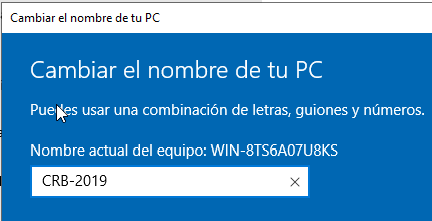
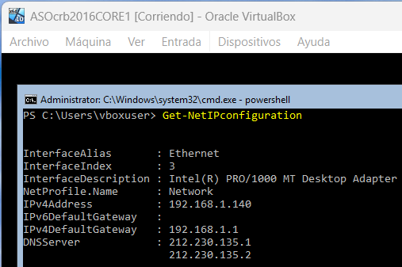
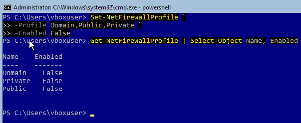
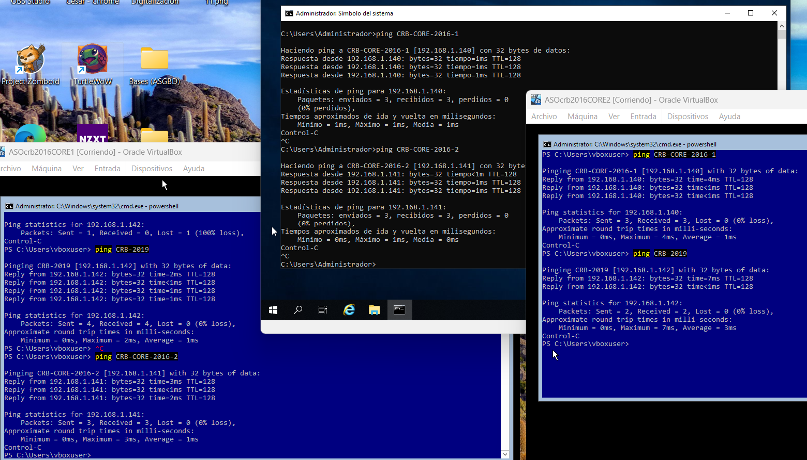
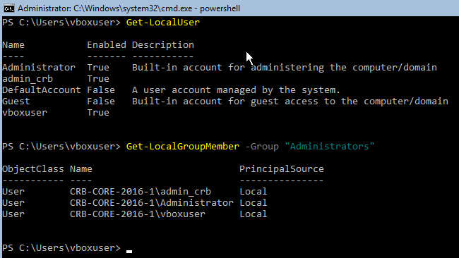

En esta práctica vamos a realizar tareas de administración remota de un servidor en modo Core utilizando Powershell..

NOTA: LA CONTRASEÑA DEL GRAFICO ES Polloroki96

1.- Entorno virtualizado

Necesitarás la siguiente configuración de máquinas virtuales:

Windows Server 2019 con experiencia de escritorio

Windows Server 2016 (1) en modo Core

Windows Server 2016 (2) en modo Core

He importado y configurado los siguientes equipos: (OJO: para instalar el GRAFICO hay que omitir instalación desatendida y seleccionar las opciones convenientes durante la instalación (Estándar experiencia de escritorio). Con la instalación desatendida instala el CORE directamente.)


Cada máquina tiene un solo adaptador puente.

Debemos hacer que la IP del adaptador de cada máquina sea estática (No lo hice en los cores). (También desactivar el firewall)

El crb2019grafico va a tener la siguiente IP, nombre y fichero hosts:




Para añadir en el fichero hosts las IPs y nombres de equipos, ejecuté un bloc de notas como administrador donde abrí el fichero hosts y escribí lo de la foto y lo guardé en C:\Windows\System32\drivers\etc


(También desactivé el firewall manualmente)

El crb2016core1 va a tener la siguiente IP, nombre y fichero hosts:




Usé la herramienta sconfig para inspeccionar y ahora el fondo de la ventana es azul.

Para añadir al final del fichero hosts las IPs y nombres de equipos usé el siguiente comando:

```bash
notepad C:\Windows\System32\drivers\etc\hosts
```


El crb2016core2 va a tener la siguiente IP, nombre y fichero hosts:


Usé la herramienta sconfig para inspeccionar y ahora el fondo de la ventana es azul.

Para añadir al final del fichero hosts las IPs y nombres de equipos usé el siguiente comando:

```bash
notepad C:\Windows\System32\drivers\etc\hosts
```


1. Preparación de las máquinas

Comprueba la conectividad entre los tres equipos:

Asigna nombres a los equipos, estos nombres serán:

Windows Server 2019 con entorno gráfico: CRB-2019

Windows Server 2016 (1) en modo core: CRB-CORE-2016-1

Windows Server 2016 (2) en modo core: CRB-CORE-2016-2

Edita el fichero hosts de cada equipo para la habilitar la resolución local de nombres entre ellos.

Antes de que las máquinas pudieran hacer ping entre ellas, desactivé el firewall en los cores con el siguiente comando:



Por fin las tres máquinas se hacen ping entre ellas:



1. Configuración del acceso remoto al nuevo equipo

El objetivo es realizar los pasos necesarios para administrar los dos equipos en modo Core desde el equipo con entorno gráfico.

Para empezar, ejecutamos este comando en ambos Cores:

```bash
Enable-PSRemoting -Force
```

Y hacemos lo siguiente para los TrustedHosts, uno en cada Core respectivamente:

```bash
Set-Item WSMan:\localhost\Client\TrustedHosts -Value "CRB-2019,CRB-CORE-2016-2" -Force
```

```bash
Set-Item WSMan:\localhost\Client\TrustedHosts -Value "CRB-2019,CRB-CORE-2016-1" -Force
```

Y para el Grafico puse:

```bash
Set-Item WSMan:\localhost\Client\TrustedHosts -Value "CRB-CORE-2016-1,CRB-CORE-2016-2" -Force
```

Así quedaron:


Para comprobar que funciona crea, desde el equipo con entorno gráfico, un usuario con privilegios de administrador llamado admin_{iniciales}.

Tuve que ejecutar esto en cada Core para conectarme de forma remota desde el Grafico (Porque no estamos en el mismo dominio):

```bash
New-ItemProperty -Path HKLM:\SOFTWARE\Microsoft\Windows\CurrentVersion\Policies\System -Name LocalAccountTokenFilterPolicy -Value 1 -Force
```

Vamos al powershell del Grafico y ejecutamos lo siguiente dos veces, una para cada Core:

OJO: LAS CREDENCIALES PARA CONECTARSE SON LAS DE LOS CORES, vboxuser y changeme en mi caso.

El usuario que vamos a crear tiene de nombre admin_crb y contraseña Polloroki96.

```bash
Enter-PSSession -ComputerName CRB-CORE-2016-1 -Credential vboxuser
```

Introducimos credenciales y estamos dentro. Ahora, para crear el usuario hacemos:

```bash
$pass = Read-Host -AsSecureString
New-LocalUser -Name "admin_crb" -Password $pass
Add-LocalGroupMember -Group "Administrators" -Member "admin_crb"
```

Vemos en el core que está creado:



Repetimos el proceso para el otro core y verificamos.

1. Configuración del acceso remoto sobre HTTPS

Una vez que hayas comprobado que tienes todo bien configurado es el momento de asegurar nuestra red preparándola para que utilice WinRM sobre HTTPS utilizando un certificado autofirmado.

Realiza los pasos necesarios para que la comunicación con ambos servidores utilice este mecanismo.


1. Configuración remota con Windows Admin Center

Por último, configura tus equipos para poder administrarlos de forma remota utilizando Windows Admin Center desde el equipo con entorno gráfico.

