En esta práctica vamos a realizar tareas de administración remota de un servidor en modo Core utilizando Powershell..

NOTA: LA CONTRASEÑA DEL GRAFICO ES Polloroki96

1.- Entorno virtualizado

Necesitarás la siguiente configuración de máquinas virtuales:

Windows Server 2019 con experiencia de escritorio

Windows Server 2016 (1) en modo Core

Windows Server 2016 (2) en modo Core

He importado y configurado los siguientes equipos: (OJO: para instalar el GRAFICO hay que omitir instalación desatendida y seleccionar las opciones convenientes durante la instalación (Estándar experiencia de escritorio). Con la instalación desatendida instala el CORE directamente.)

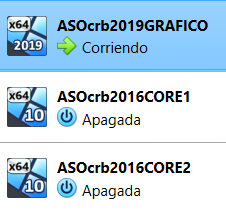

Cada máquina tiene un solo adaptador puente.

Debemos hacer que la IP del adaptador de cada máquina sea estática (No lo hice en los cores). (También desactivar el firewall)

El crb2019grafico va a tener la siguiente IP, nombre y fichero hosts:

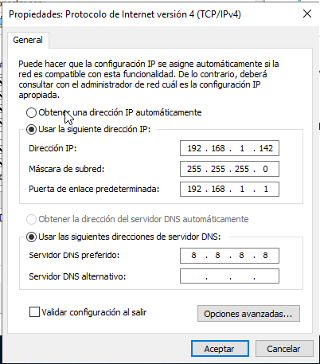


Para añadir en el fichero hosts las IPs y nombres de equipos, ejecuté un bloc de notas como administrador donde abrí el fichero hosts y escribí lo de la foto y lo guardé en C:\Windows\System32\drivers\etc

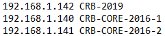

(También desactivé el firewall manualmente)

El crb2016core1 va a tener la siguiente IP, nombre y fichero hosts:

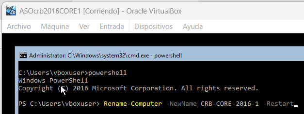


Usé la herramienta sconfig para inspeccionar y ahora el fondo de la ventana es azul.

Para añadir al final del fichero hosts las IPs y nombres de equipos usé el siguiente comando:

```bash
notepad C:\Windows\System32\drivers\etc\hosts
```


El crb2016core2 va a tener la siguiente IP, nombre y fichero hosts:

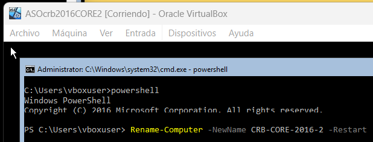

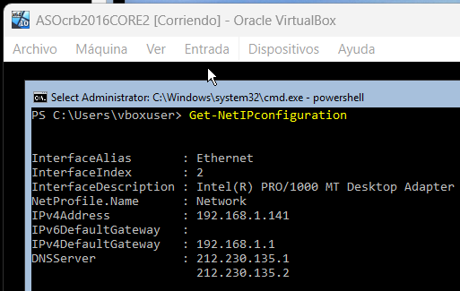

Usé la herramienta sconfig para inspeccionar y ahora el fondo de la ventana es azul.

Para añadir al final del fichero hosts las IPs y nombres de equipos usé el siguiente comando:

```bash
notepad C:\Windows\System32\drivers\etc\hosts
```


1. Preparación de las máquinas

Comprueba la conectividad entre los tres equipos:

Asigna nombres a los equipos, estos nombres serán:

Windows Server 2019 con entorno gráfico: CRB-2019

Windows Server 2016 (1) en modo core: CRB-CORE-2016-1

Windows Server 2016 (2) en modo core: CRB-CORE-2016-2

Edita el fichero hosts de cada equipo para la habilitar la resolución local de nombres entre ellos.

Puse IP estática para los Cores en la consola de comandos así: (Esto es para uno, repetir para la otra):

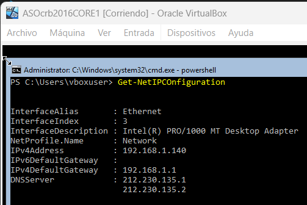

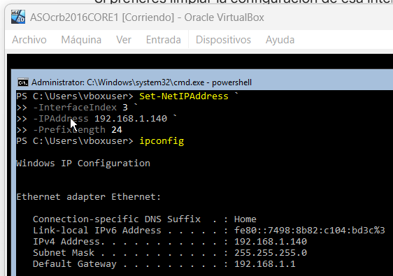

(OJO: Si el InterfaceIndex ya está configurado y estamos en otra red, haremos lo mismo pero con New-NetIPAddress)

(OJO: No parece ser necesario especificar una DefaultGateway, las máquinas hacen ping bien entre ellas)

Antes de que las máquinas pudieran hacer ping entre ellas, desactivé el firewall en los cores con el siguiente comando:


Por fin las tres máquinas se hacen ping entre ellas:


1. Configuración del acceso remoto al nuevo equipo

El objetivo es realizar los pasos necesarios para administrar los dos equipos en modo Core desde el equipo con entorno gráfico.

Para empezar, ejecutamos este comando en ambos Cores:

```bash
Enable-PSRemoting -Force
```

Y hacemos lo siguiente para los TrustedHosts, uno en cada Core respectivamente:

```bash
Set-Item WSMan:\localhost\Client\TrustedHosts -Value "CRB-2019,CRB-CORE-2016-2" -Force
```

```bash
Set-Item WSMan:\localhost\Client\TrustedHosts -Value "CRB-2019,CRB-CORE-2016-1" -Force
```

Y para el Grafico puse:

```bash
Set-Item WSMan:\localhost\Client\TrustedHosts -Value "CRB-CORE-2016-1,CRB-CORE-2016-2" -Force
```

Así quedaron:

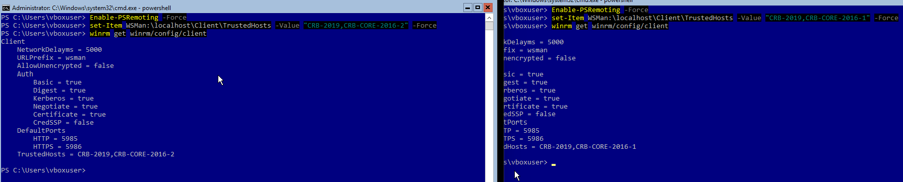

Para comprobar que funciona crea, desde el equipo con entorno gráfico, un usuario con privilegios de administrador llamado admin_{iniciales}.

Tuve que ejecutar esto en cada Core para conectarme de forma remota desde el Grafico (Porque no estamos en el mismo dominio):

```bash
New-ItemProperty -Path HKLM:\SOFTWARE\Microsoft\Windows\CurrentVersion\Policies\System -Name LocalAccountTokenFilterPolicy -Value 1 -Force
```

Vamos al powershell del Grafico y ejecutamos lo siguiente dos veces, una para cada Core:

OJO: LAS CREDENCIALES PARA CONECTARSE SON LAS DE LOS CORES, vboxuser y changeme en mi caso.

El usuario que vamos a crear tiene de nombre admin_crb y contraseña Polloroki96.

```bash
Enter-PSSession -ComputerName CRB-CORE-2016-1 -Credential vboxuser
```

Introducimos credenciales y estamos dentro. Ahora, para crear el usuario hacemos:

```bash
$pass = Read-Host -AsSecureString
New-LocalUser -Name "admin_crb" -Password $pass
Add-LocalGroupMember -Group "Administrators" -Member "admin_crb"
```

Vemos en el core que está creado:


Repetimos el proceso para el otro core y verificamos.

1. Configuración del acceso remoto sobre HTTPS

Una vez que hayas comprobado que tienes todo bien configurado es el momento de asegurar nuestra red preparándola para que utilice WinRM sobre HTTPS utilizando un certificado autofirmado.

Realiza los pasos necesarios para que la comunicación con ambos servidores utilice este mecanismo.

Para hacer esto se llevaron a cabo los pasos desde la hoja 26 hasta la 40 del pdf de la UT04.

Primero lo hacemos para un Core, y luego repetimos todo para el otro.

Empezamos:

Hacemos en el Core 1:

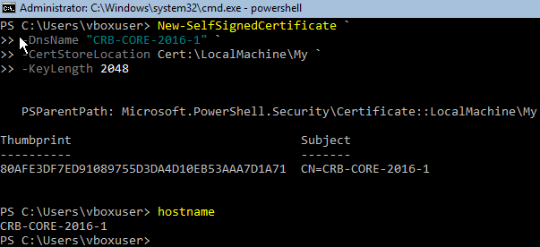

CUIDADO: EL DNS ES EL NOMBRE DEL CORE 1

(Tuve que repetir todo este proceso. El hash correcto es el de la imagen anterior, conservo el hash erróneo en las siguientes imágenes porque lo que importa es el proceso y sólo cambia ese hash)

Borramos el listener:

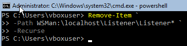

Creamos el nuevo listener con el hash del certificado que hemos creado:

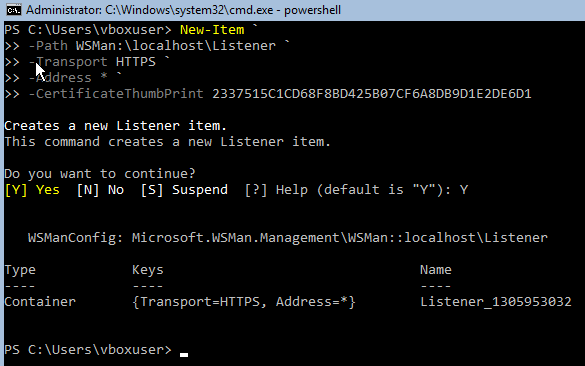

Vemos que el puerto del HTTPS está abierto en el firewall:

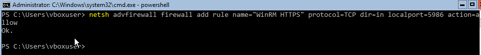

Antes de conectarse desde el Grafico con -UseSSL, debemos importarlo en el Grafico. Para ello en el Core:

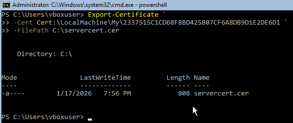

Ahora nos vamos al Grafico y hacemos una carpeta compartida llamada "compartida" en la que vamos a meter el certificado.

Se llevaron a cabo los siguientes pasos gráficamente:

```bash
Crear la carpeta física:

Abre el Explorador de archivos.

Ve a la raíz del disco C:.

Haz clic derecho y selecciona Nuevo > Carpeta.

Ponle el nombre que quieras.

2. Compartir la carpeta con el alias "compartida"

Aquí es donde vinculas la carpeta física con la ruta de red que espera el Core:

Haz clic derecho sobre la carpeta que acabas de crear y selecciona Propiedades.

Ve a la pestaña Uso compartido (Sharing) y haz clic en Uso compartido avanzado...

Marca la casilla Compartir esta carpeta.

En Nombre del recurso compartido, borra lo que haya y escribe exactamente: compartida.

Haz clic en el botón Permisos:

Selecciona "Todos".

Dale todos los permisos.

Acepta todas las ventanas.

4. Asegurar el acceso

A veces, aunque compartas la carpeta, Windows bloquea el acceso por seguridad de archivos.

En la misma ventana de Propiedades de la carpeta, ve a la pestaña Seguridad.

Haz clic en Editar > Agregar.

Escribe Todos, dale a comprobar nombres y acepta.

Dale permisos y acepta.
```

Ya la carpeta está lista para recibir el certificado.

De vuelta al Core hacemos:

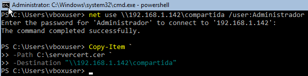

Y en el Grafico vemos que la hemos recibido:

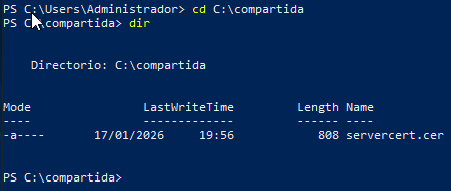

Importamos el certificado (seguimos en el Grafico):

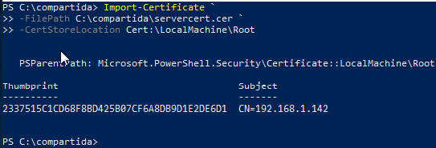

Vemos que se ha importado correctamente:

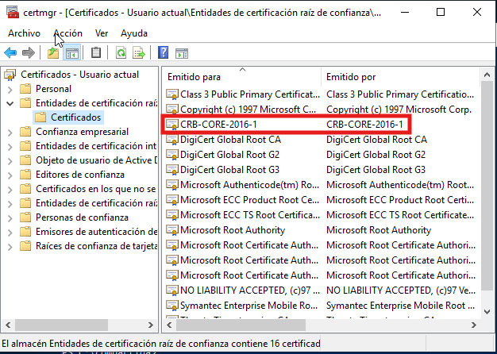

(Esa imagen contiene el certificado corregido)

Y, por fin, nos conectamos con -UseSSL:

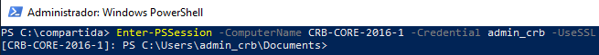

Todo esto es para un solo Core. Se hace lo mismo para el otro.

Una vez repetido el proceso, conseguimos lo dos certificados en certmgr y ya podemos conectarnos con -UseSSL a ambos:

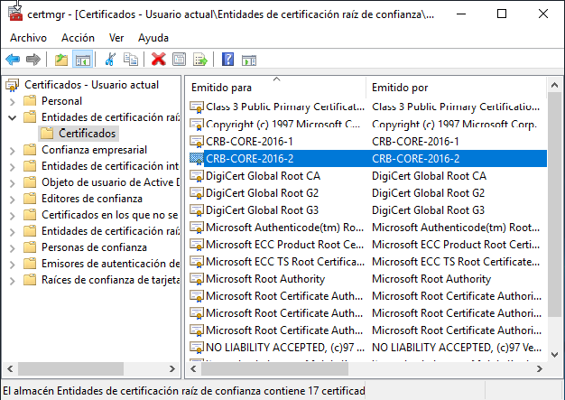

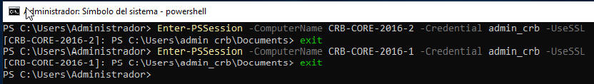

1. Configuración remota con Windows Admin Center

Por último, configura tus equipos para poder administrarlos de forma remota utilizando Windows Admin Center desde el equipo con entorno gráfico.

Para hacer este ejercicio usamos el pdf de la UT04 desde la página 42 a la 58.

Lo primero que vamos a hacer es desactivar la configuración de seguridad mejorada desde el administrador del servidor del Grafico:

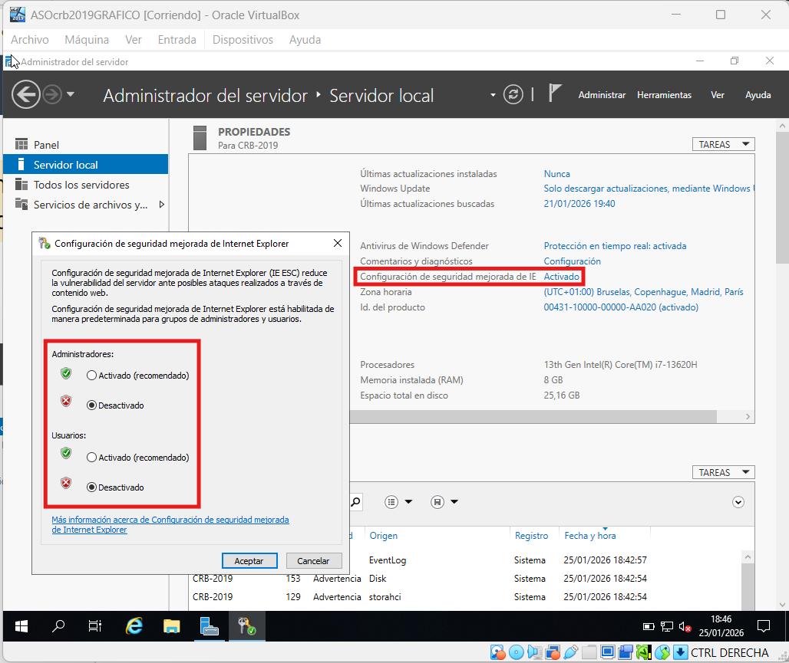

Ahora podemos entrar al enlace e instalarlo tal y como nos dice el pdf.

Hubo que pasar con un pincho el archivo .exe para instalar. 

La instalación se hizo con la guía que se indica en el pdf, no fue exactamente igual.

Instalando:

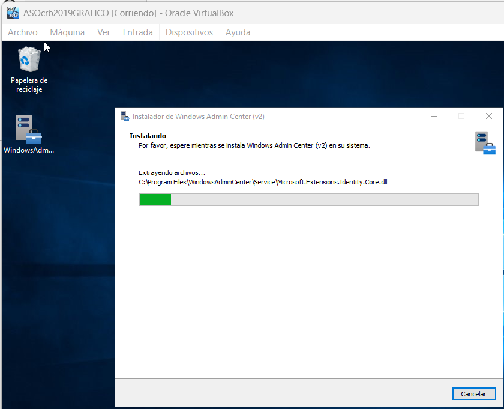

Al finalizar lanzamos el WAC y me dice lo que avisaba en el pdf: que hay que decirle que confiamos en nuestro certificado autofirmado que generamos durante la instalación.

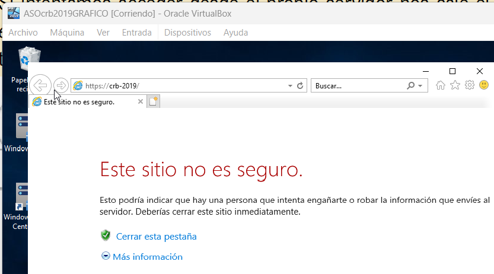

Le damos a Continuar y rellenamos con las credenciales:

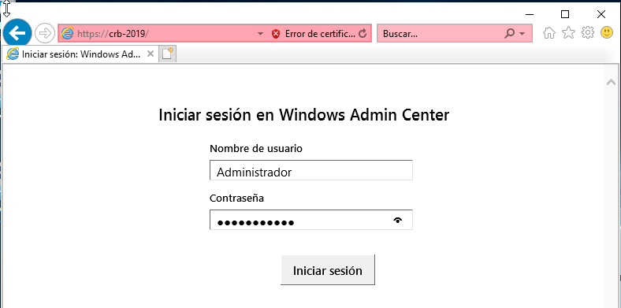

Desgraciadamente al darle a Iniciar sesión no hace nada. Nos vamos desde la nativa tal que así:

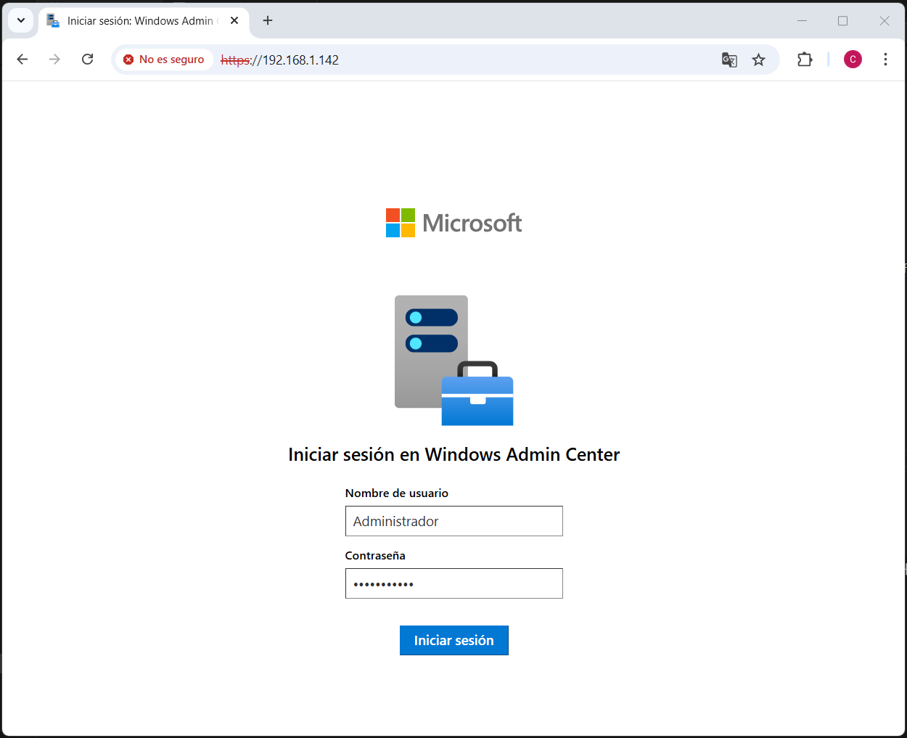

Y conseguimos entrar y ver nuestro Grafico:

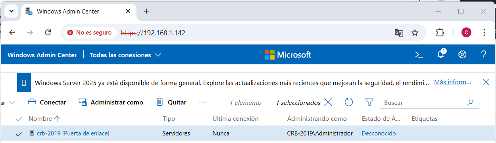

Podemos Agregar los Cores dando credenciales de administrador, la de admin_crb que creamos en ellos:

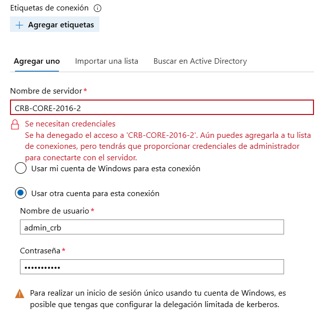

Ahora tenemos toda la red:

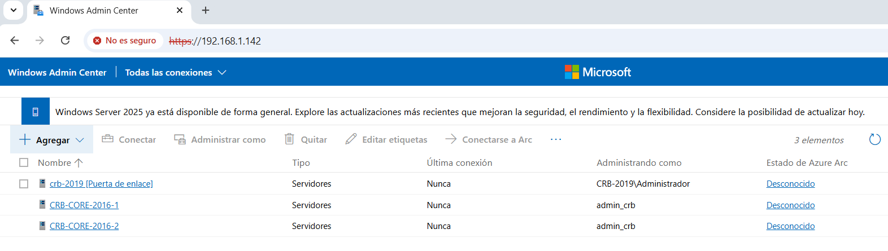

Y podemos entrar en cualquiera de ellos a ver datos:

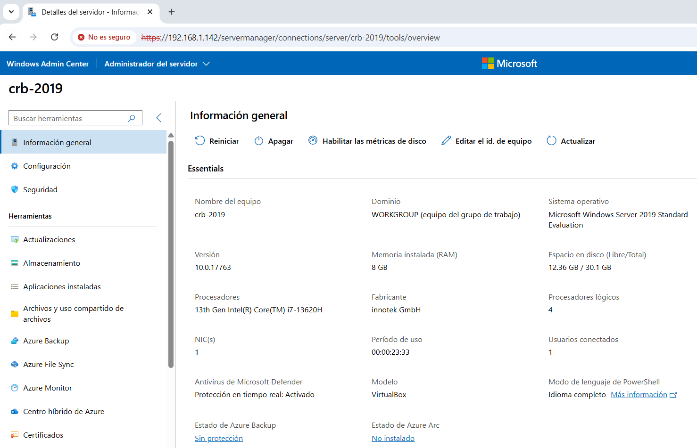

Eso sería todo.