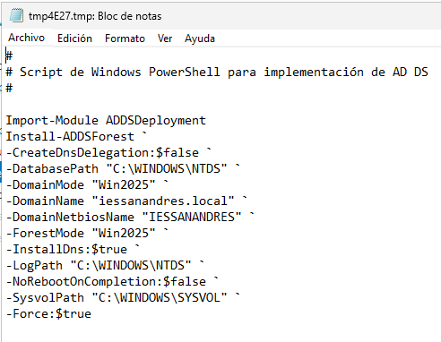
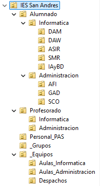
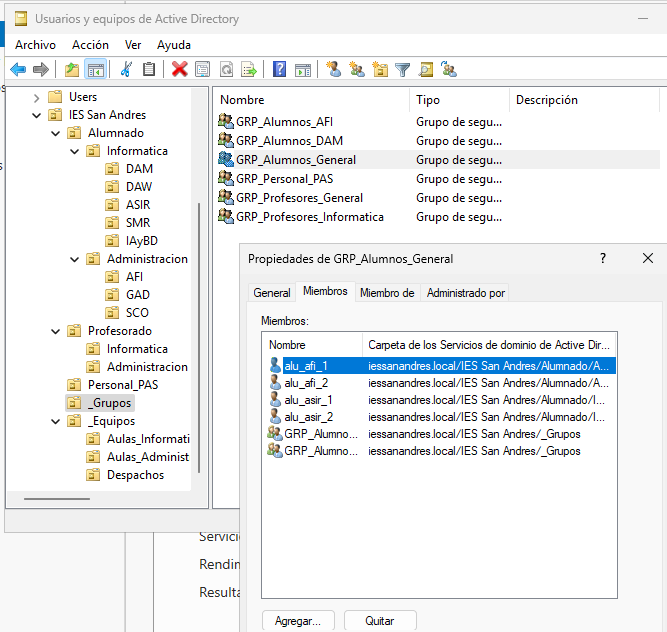
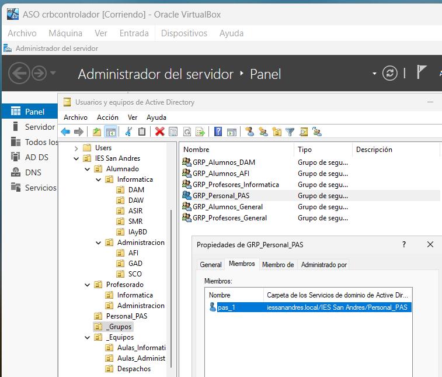
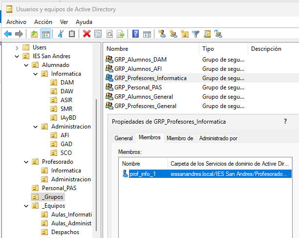
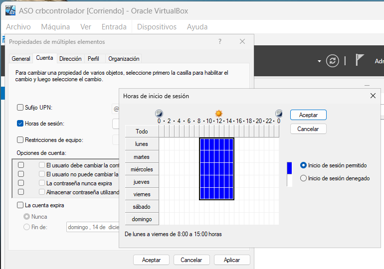
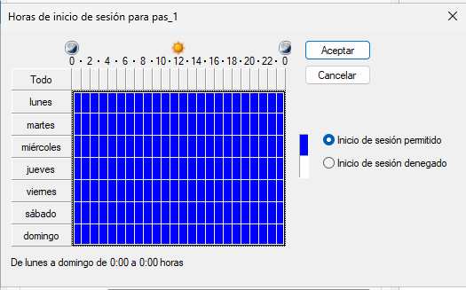
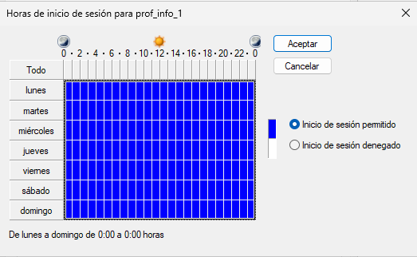

Tarea 1: Promoción del controlador de dominio
Promueve el servidor a controlador de dominio configurando un nuevo bosque con el nombre de dominio raíz: iessanandres.local.

Este es el script de lo que se pide:

Tarea 2: Diseño de la Estructura de Unidades Organizativas (UO)
Usando la consola “Usuarios y equipos de Active Directory” (dsa.msc), debes crear una jerarquía de Unidades Organizativas que refleje la estructura del centro.

Requisito: La estructura debe ser lógica y permitir aplicar políticas de forma diferenciada. Se propone la siguiente estructura (puedes mejorarla si lo justificas):

El árbol ha quedado así:

Tarea 3: Creación de Usuarios y Grupos
Debes poblar la estructura con algunos usuarios y grupos de ejemplo.

Ojo: La contraseña de todo lo creado en este ejercicio es Polloroki1996

Aquí algunas capturas de los grupos conteniendo a los usuarios ya creados como se pedía:

Tarea 4: Restricción de Horas de Inicio de Sesión

Al final, como los 4 alumnos estaban en unidades organizativas diferentes, tuvimos que seleccionarlos en 2 en 2 yendo a sus respectivas UOs.

Para los 4 alumnos esto se quedó configurado:

El personal sigue teniendo acceso 24/7:

