Creación de usuarios y grupos:

Siguiendo la práctica del otro día, crea una carpeta personal para todos los alumnos de ASIR.

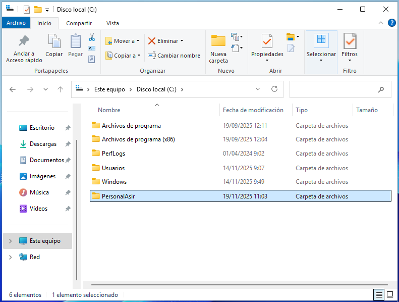

He creado PersonalAsir y ahora se la voy a compartir a los alumos de ASIR.

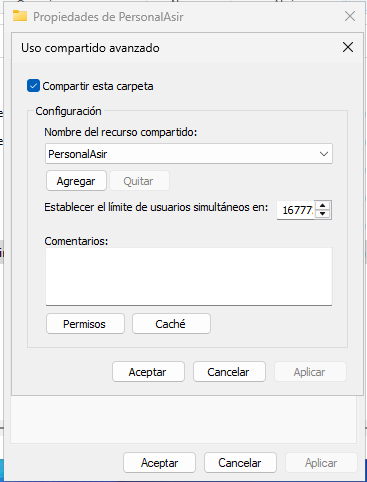

He compartido y configurado el nombre con el que se mostrará a los usuarios en Propiedades - Uso compartido avanzado.

Me dice que su ruta de acceso de red es "\\\CRBCONTROLADOR\PersonalAsir"

Doy permisos de lectura y escritura a alu_asir_1 y alu_asir_2:

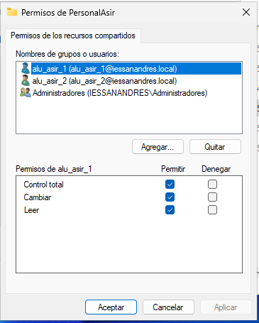

He compartido la carpeta con alu_asir_1 y alu_asir_2:

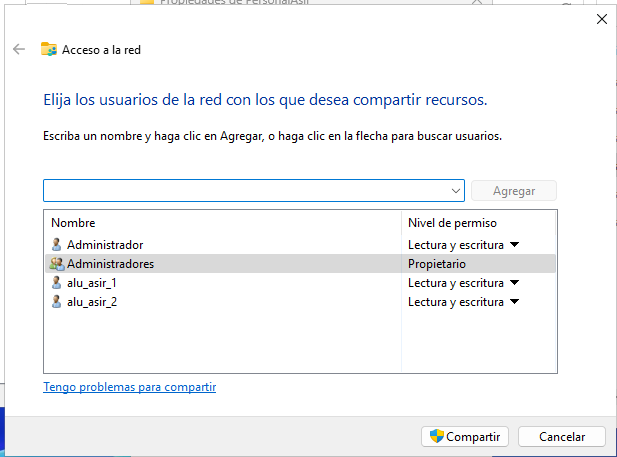

Ahora vamos a configurar las cuentas de cada usuario para que la utilicen como lugar de almacenamiento en red.
Esto lo hacemos desde la herramienta Usuarios y equipos de Active Directory:

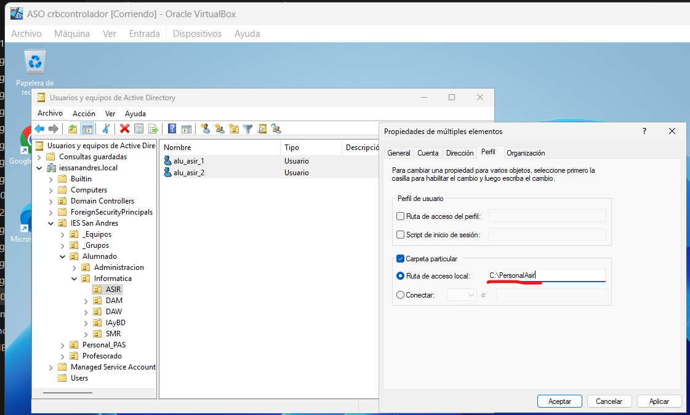

Seleccionamos ambos y vamos a propiedades - perfil, allí podremos configurar eso. Ya estaría la carpeta compartida y lista para usar por los alumnos de ASIR.

Carpetas personales:

Instala el Administrador de recursos del servidor de archivos que está dentro del rol Servicios de archivos y almacenamiento

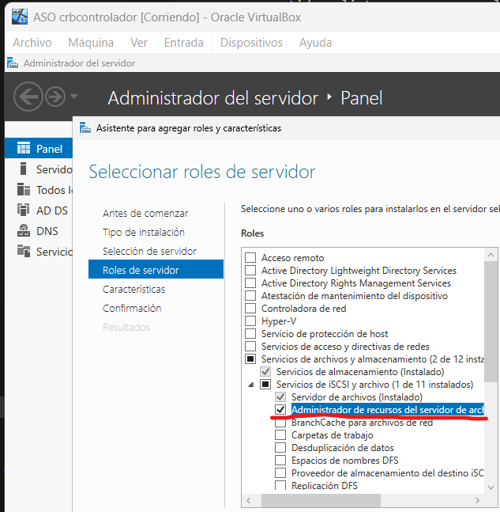

Ya está instalado.

Utilizando la herramienta Servicios de archivos y de almacenamiento del Administrador del servidor, crea una carpeta para cada usuario dentro de C:\shares y realiza los pasos necesarios para que ambos usuarios puedan ver esta carpeta como una unidad de red identificada con la letra H:

En la herramienta Servicios de archivos y almacenamiento, en Tarea, cerca de donde dice Netlogon, agregamos un nuevo recurso compartido, y especificamos la ruta de shares:

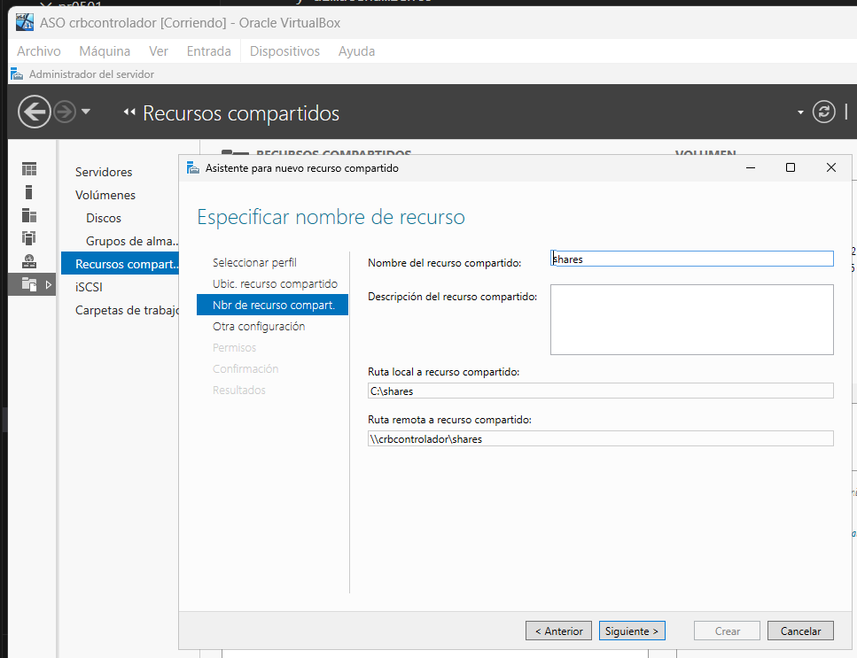

Ya tenemos creado el recurso compartido.

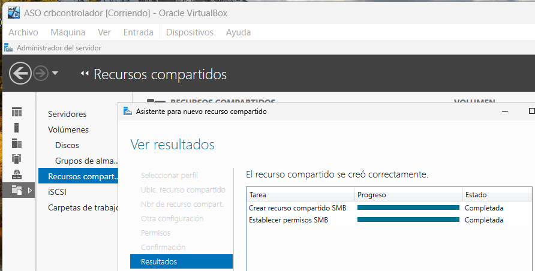

Todos los administrativos tienen permisos en la carpeta shares, pero ahora vamos a crear y configurar una carpeta para cada usuario de ASIR dentro de shares y que sólo pueda acceder cada usuario a la suya.

Para ello hacemos lo siguiente para cada uno:

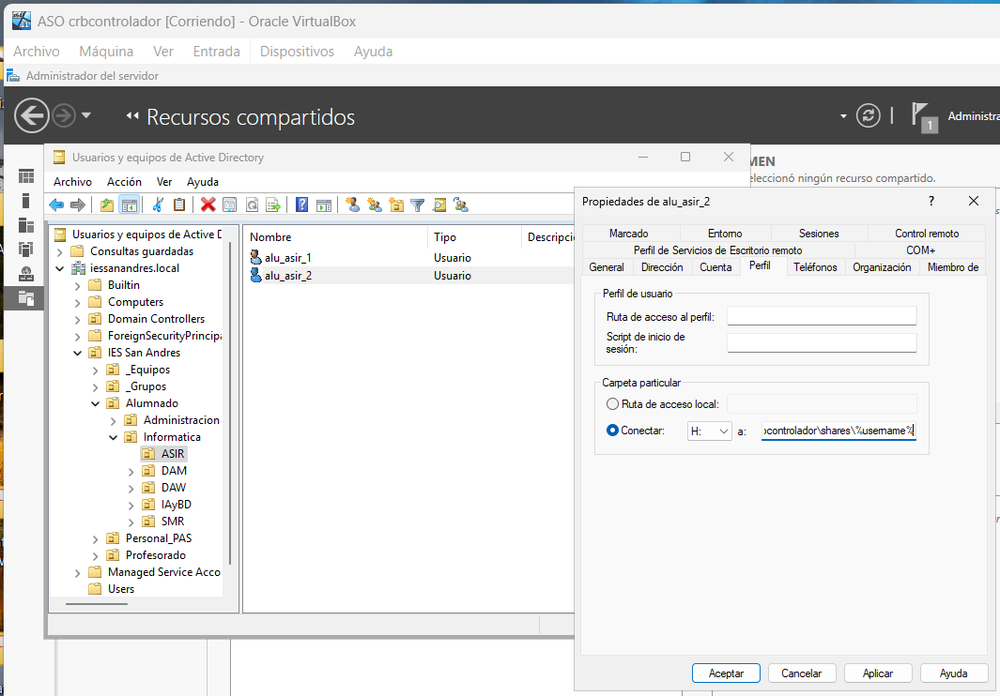

Hemos especificado la ruta remota tal y como está escrita y se creará una carpeta para cada usuario tal que así:

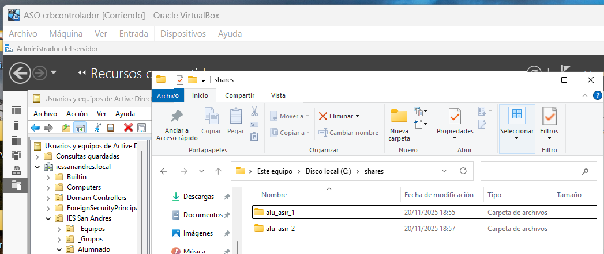

Ahí están creadas.

Comprueba que la carpeta de cada usuario solo pueda ser accedida por él mismo.

NOTA: EL DOMINIO CREADO ACTÚA COMO DNS

(Antes de hacer esto hubo que asegurarse que mi máquina W10cliente es parte del dominio iessanandres.local. Para ello, entramos en la máquina de W10cliente con una cuenta con permisos y fuimos a donde se cambia el nombre a sacarla del dominio antiguo asir.local. Reiniciamos, volvimos a entrar con el administrador local y especificamos que nuestra preferencia para resolver DNS es la IP de nuestro controlador de dominio (IMPORTANTE ESO) y posteriormente, en la ventana donde cambiamos el nombre y el dominio especificamos el nuevo dominio iessanandres.local. Reiniciamos y ahora sí, se puede llevar a cabo la comprobación de este ejercicio)

Entrando en W10cliente ya configurado vemos que alu_asir_1 sólo puede acceder a su carpeta correspondiente:

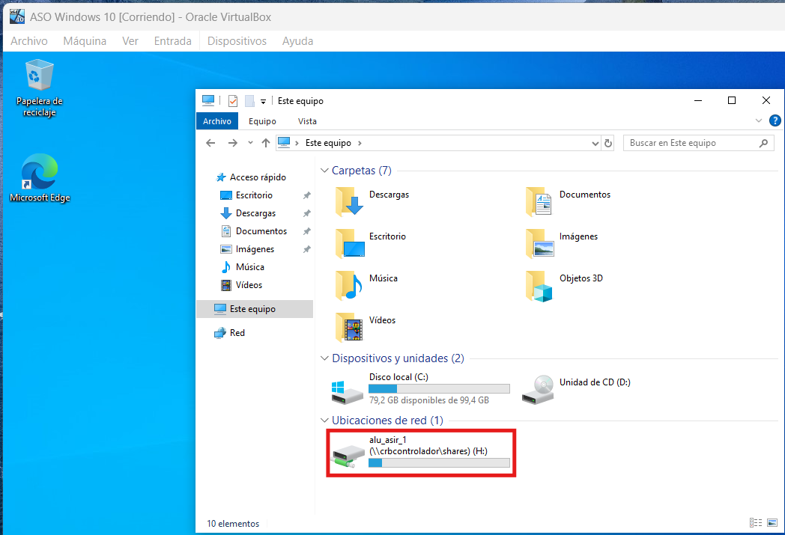

Y también alu_asir_2 sólo puede acceder a su carpeta correspondiente:

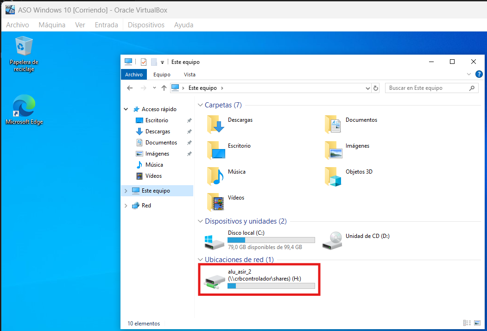

Carpetas compartidas por un grupo:

Crea en C:\shares una carpeta llamada apuntes y realiza las tareas necesarias para que los alumnos de ASIR puedan acceder a ella como un espacio de almacenamiento compartido con permiso de lectura.

Creamos la carpeta donde nos piden y le damos a Conceder acceso a - Usuarios específicos, y le damos permiso de lectura al grupo que hemos creado previamente GRP_Alumnos_Asir en el que hemos metido a alu_asir_1 y alu_asir_2:

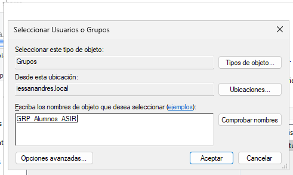

NOTA: LAS CARPETAS SE COMPARTEN A GRUPOS, NO A UNIDADES ORGANIZATIVAS. SI QUIERO COMPARTIR ALGO A LOS MIEMBROS DE UNA UNIDAD ORGANIZATIVA, DEBO METERLOS EN UN GRUPO PRIMERO Y COMPARTIR A ESE GRUPO.

Los permisos han quedado así:

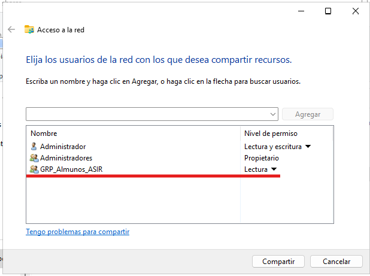

Ahora vamos a crear nuestro script en NETLOGON para hacer que la carpeta se monte automáticamente como unidad de red en los equipos de los usuarios:

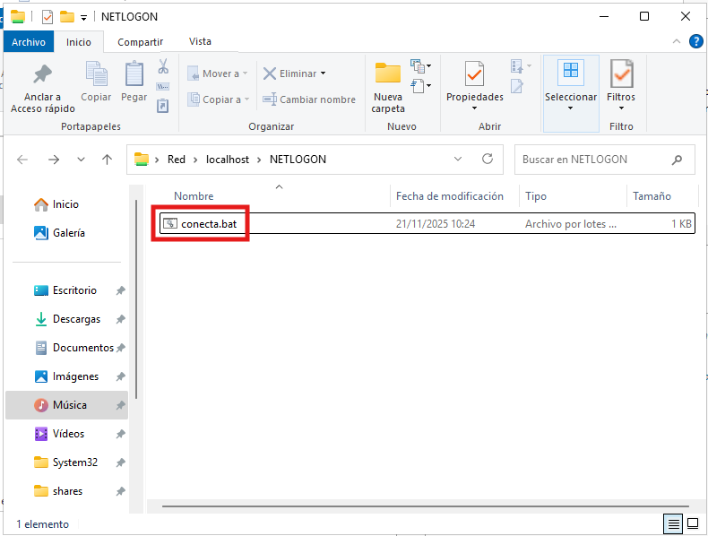

(Configuré el archivo conecta.bat primero como txt y le escribí la línea net use h: \\\crbcontrolador\shares\apuntes)

Luego crea otra llamada práctica en la que tengan permiso de lectura y escritura

