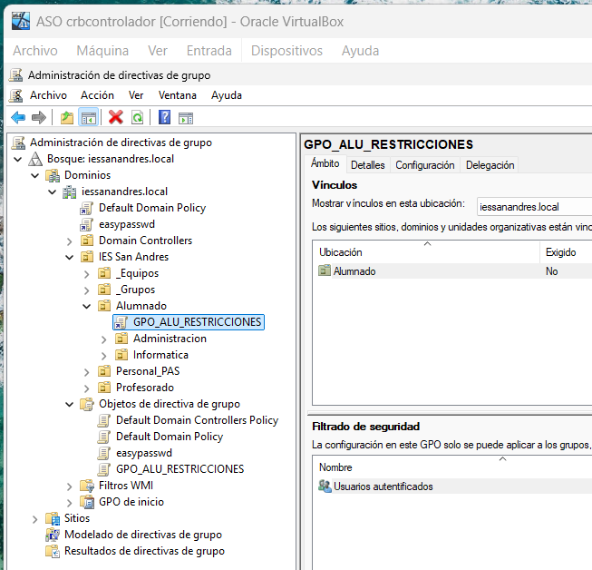
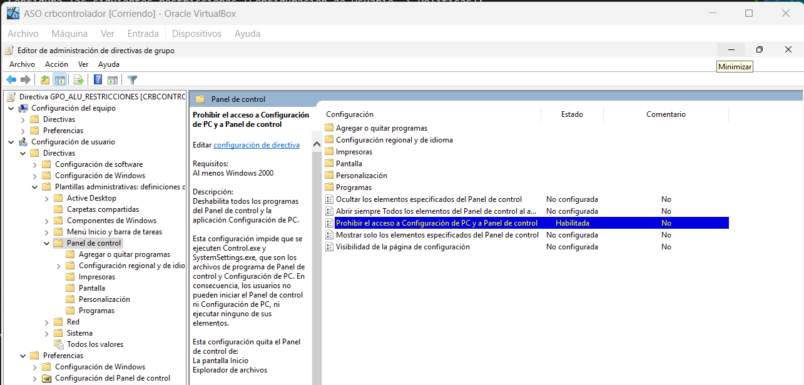
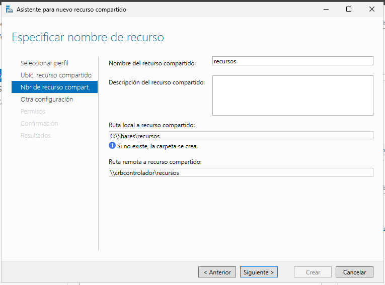
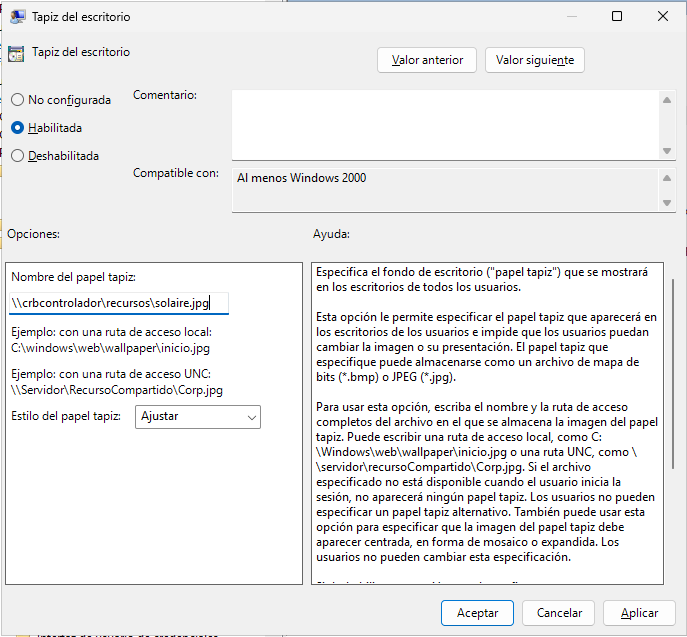
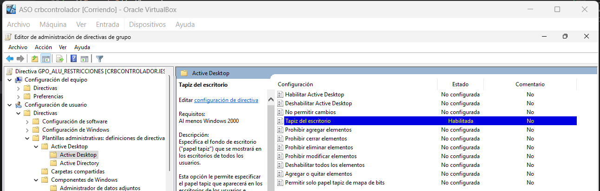
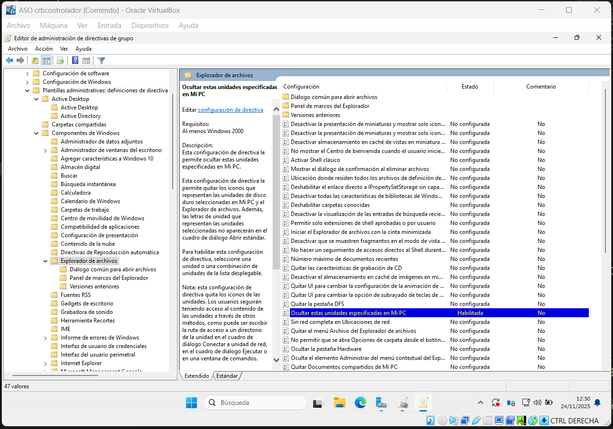
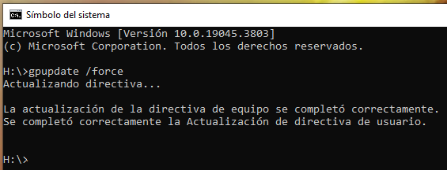
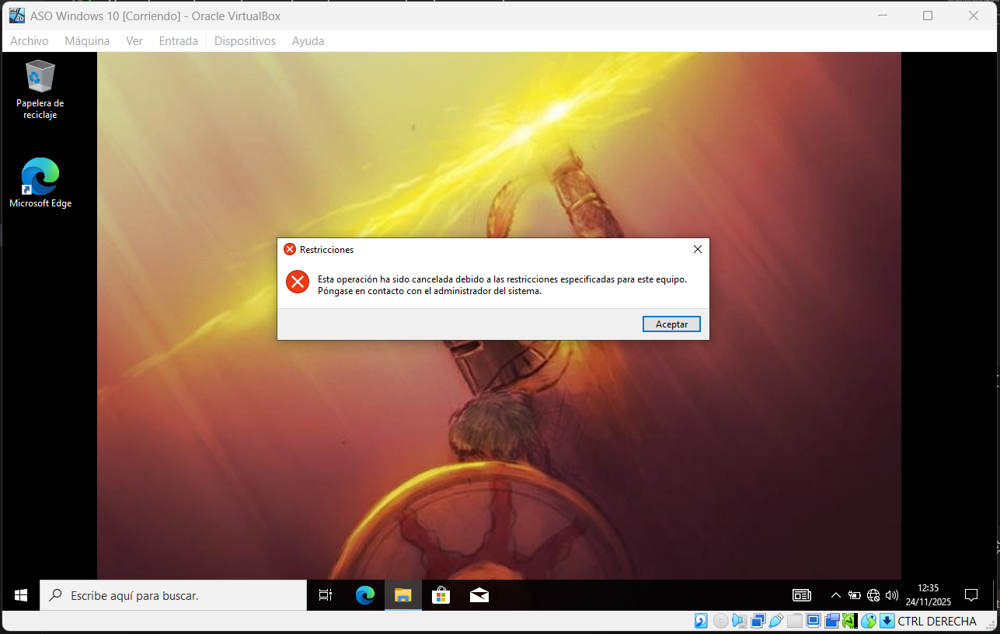

Requisitos Previos:

Dominio iessanandres.local operativo.
Estructura de UOs (Alumnado, Profesorado, Ciclos) creada.
Al menos un equipo cliente (Windows 10/11) unido al dominio.
Los usuarios (ej. alu_dam_1, prof_info_1) deben existir.

Una vez cumplido todo, comenzamos.

PARTE 1

Tarea 1.1: Creación del GPO “Restricciones Alumnos”

Crea un nuevo GPO llamado GPO_ALU_RESTRICCIONES.

Nos vamos al administrador de directivas de grupo.

Hago la GPO mediante clic derecho en la UO de Alumnado - Crear un GPO en este dominio y vincularlo aquí.

Vincula este GPO a la UO raíz Alumnado (Ya está vinculado desde que lo creamos).

Configura las siguientes restricciones (Configuración de Usuario -> Políticas):

Vamos a cada lugar navegando a través del editor de administración de políticas de grupo.

Bloqueo del Panel de Control: navega a Plantillas administrativas > Panel de control. Habilita la política “Prohibir el acceso al Panel de control y a la configuración del equipo”.

Establecer Fondo de Escritorio: navega a Plantillas administrativas > Escritorio > Escritorio. Habilita la política “Fondo de escritorio” y establece una ruta de red válida (ej. \\\servidor_dc\recursos\fondo.jpg).

Primero creo otro recurso compartido:

Tras coger una imagen y guardarla en la ruta propuesta, usamos la ruta para especificar el fondo.

Y ya estaría configurada esta política:

Ocultar unidades de disco: navega a Plantillas administrativas > Componentes de Windows > Explorador de archivos. Habilita la política “Ocultar estas unidades específicas en Mi PC” y selecciona la opción “Restringir las unidades A, B, C y D”.

Ya está configurada simplemente siguiendo el enunciado:

Tarea 1.2: Verificación de usuario

Inicia sesión en el equipo cliente con un usuario alumno (ej. alu_asir_1).

Ejecuta gpupdate /force.

Verifica que: El fondo de pantalla ha cambiado y no se puede abrir el Panel de Control.

PARTE 2

Tarea 2.1: Política de seguridad (UO Equipos)

Crea un nuevo GPO llamado GPO_SEG_BASE.

Vincula este GPO a la UO _Equipos\Aulas_Informatica (donde deben estar los equipos del aula).

Configura la siguiente política (Configuración de Equipo -> Políticas -> Configuración de Windows):

Navega a Configuración de seguridad > Directivas de cuentas > Directiva de contraseña.

Establece “Longitud mínima de la contraseña” en 8 caracteres.

Configura otra política de seguridad:

Navega a Configuración de seguridad > Directivas locales > Opciones de seguridad.

Establece “Cuentas: Cambiar nombre de la cuenta de administrador” a un nombre no estándar (ej. AdministradorLocal01).

Tarea 2.2: Mapeo de unidad específica (UO Administración)

Esta política debe mapear una unidad de red Z: para el alumnado de la familia de Administración.

Crea un GPO llamado GPO_ADM_UNIDAD_Z.

Vincula este GPO a la UO Alumnado\Administracion.

Configura la siguiente política (Configuración de Usuario -> Preferencias -> Configuración de Windows -> Asignaciones de Unidad):

Acción: crea una nueva Asignación de Unidad.

Ubicación: \\servidor_dc\compartido\administracion (Asume que esta ruta existe).

Etiqueta: Recursos_ADM

Letra de Unidad: Z:

Tarea 2.3: Verificación de Recurso

Inicia sesión con un alumno de informática (ej. alu_dam_1). Verifica que NO tiene la unidad Z:.

Inicia sesión con un alumno de administración (ej. alu_afi_1). Verifica que SÍ aparece la unidad Z:.
