Parte 1: Endurecimiento de la seguridad

Debes crear una GPO llamada GPO_Harden_Security_Equipos vinculada a la UO _Equipos. Configura las siguientes directivas:

Ya está creada y vinculada:

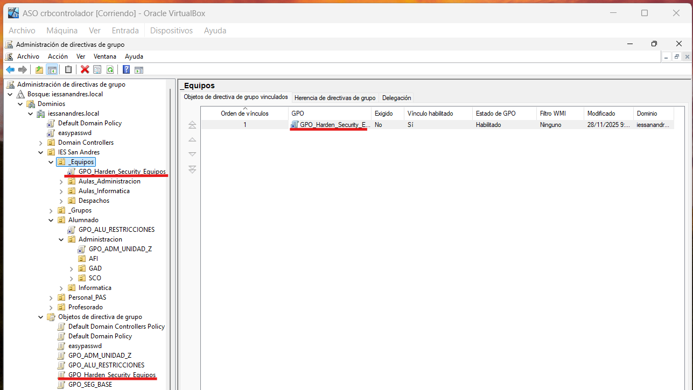

1.1. Protección de cuentas y acceso

Renombrar cuenta de administrador: por seguridad, la cuenta local Administrador es un objetivo común de ataques. Configura la directiva para que esta cuenta se renombre a Admin_Local_IES.

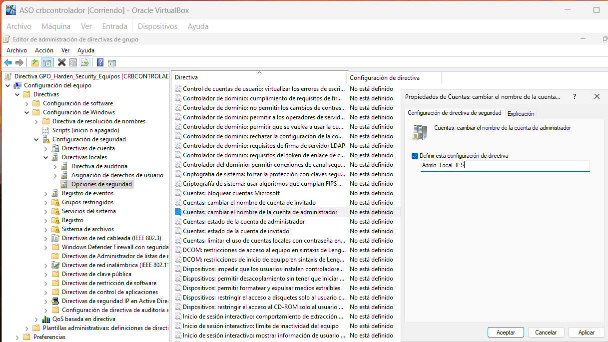

Aplicamos, aceptamos y ya estaría.

Inicio de sesión interactivo: configura el equipo para que no requiera pulsar Ctrl+Alt+Supr para iniciar sesión.

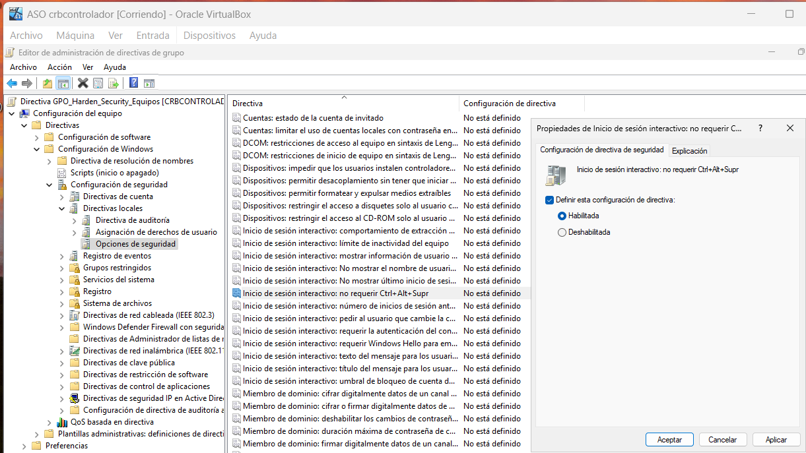

Aplicamos, habilitamos y ya estaría. OJO: lo habilitamos porque la directiva dice "NO requerir", cuidado con eso.

1.2. Aviso legal (Consentimiento Informado)

Configura el sistema para que, antes de iniciar sesión, muestre un mensaje legal a los usuarios.
Título: Aviso de Seguridad del IES San Andrés
Texto: El uso de este equipo está monitorizado. El acceso está restringido únicamente a personal y alumnado autorizado.

Para el título del mensaje:

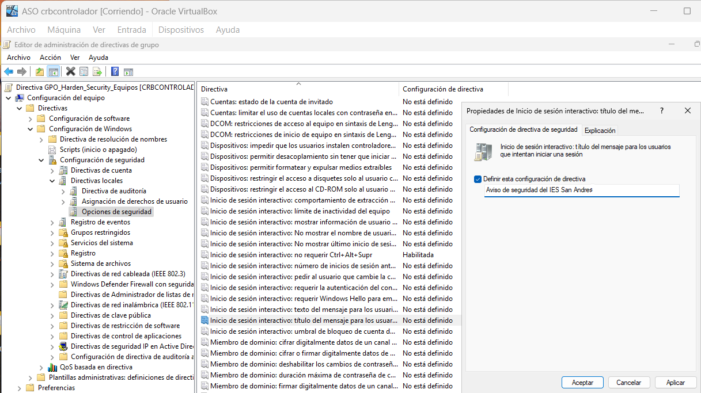

Para el texto del mensaje:

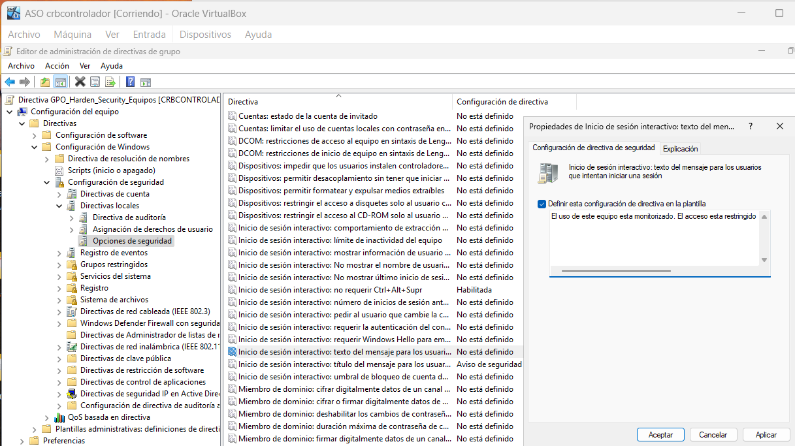

En ambos aplicamos y aceptamos.

1.3. Privacidad y apagado

Privacidad: Configura el inicio de sesión interactivo para que no muestre el último nombre de usuario que inició sesión.

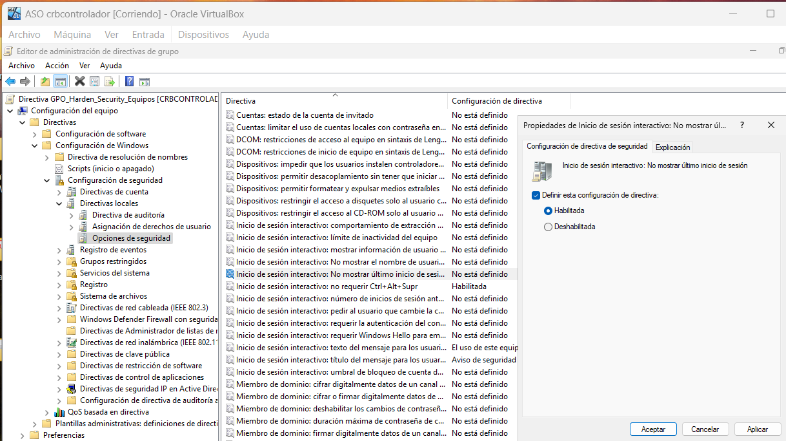

Habilitamos y aplicamos y ya estaría.

Apagado: Deshabilita la opción que permite apagar el sistema sin tener que iniciar sesión. Queremos evitar que alumnos apaguen equipos de aulas remotamente o desde la pantalla de bloqueo sin identificarse.

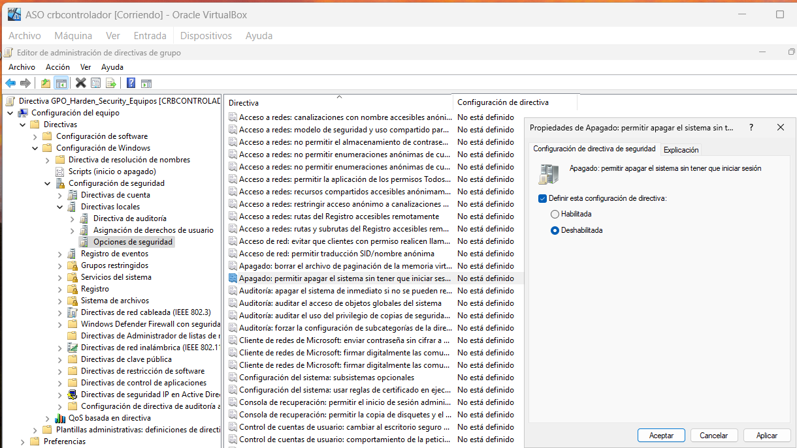

Deshabilitamos y aplicamos y ya estaría.

Parte 2: Preferencias de Grupo (GPP) y segmentación

En esta sección usarás Preferencias (Configuración de usuario -> Preferencias) en lugar de Directivas (Policies). Debes crear una GPO llamada GPO_Configuracion_Usuario_Dinamica y vincularla a la raíz del dominio (o a las UOs de usuarios pertinentes).

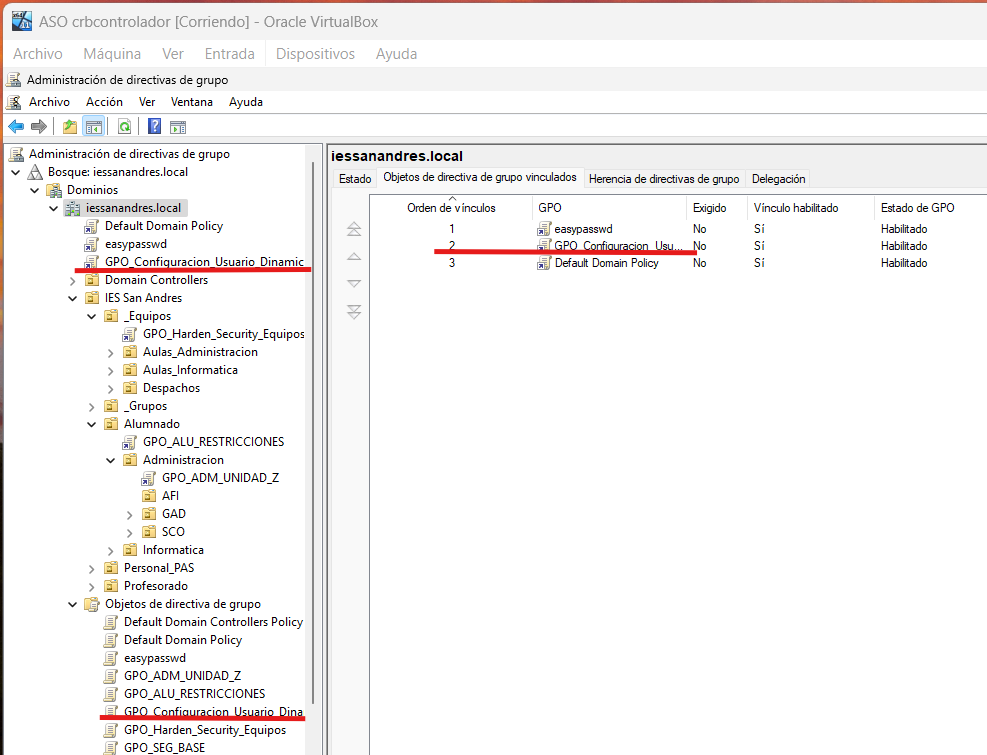

Ya está creada y vinculada.

2.1. Mapeo de unidades de red (Drive Maps)

Los profesores necesitan acceder a una carpeta compartida para sus materiales, pero los alumnos no deben ver esa unidad.

Crea una unidad de red mapeada (ej. letra P:) que apunte a una carpeta compartida del servidor (puedes crear una carpeta compartida llamada Recursos_Profesores en el DC).

Lo primero que hice fue crear GRP_Profesores_General en mi Active Directory y meter en él a prof_info_1.

He creado el directorio Recursos_Profesores en C: y en Propiedades - Compartir he configurado tal que así:

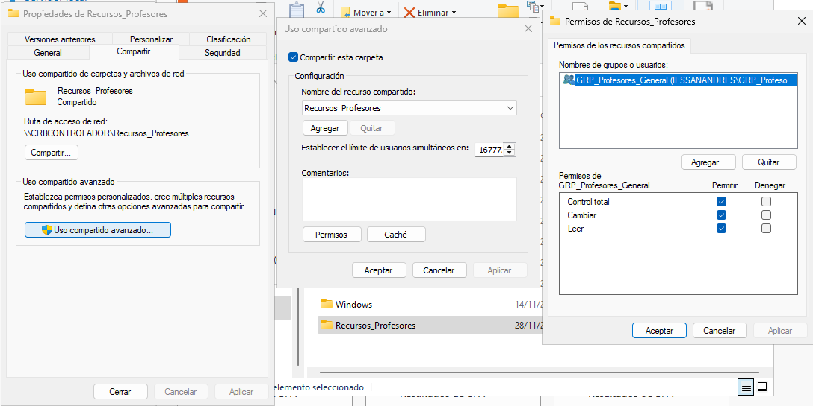

Y ahora he creado la Asignación de unidad mediante GPP para Recursos_Profesores tal que así:

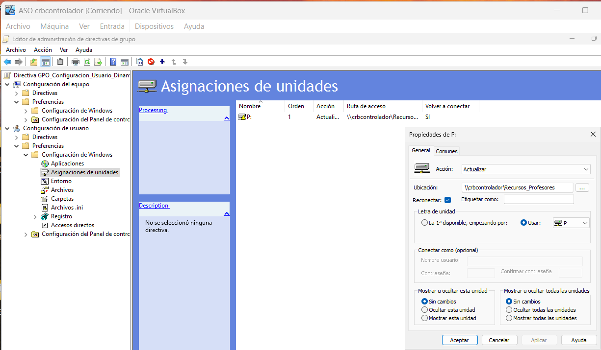

Aplicamos y aceptamos.

Requisito: Usa Item-Level Targeting (Destinatarios) para que esta unidad SOLO se monte si el usuario pertenece al grupo GRP_Profesores_General.

Configuramos el requisito tal que así:

Primero nos vamos a Comunes en la pestaña de la captura anterior y vamos a Destinatarios y agregamos nuevo grupo de seguridad:

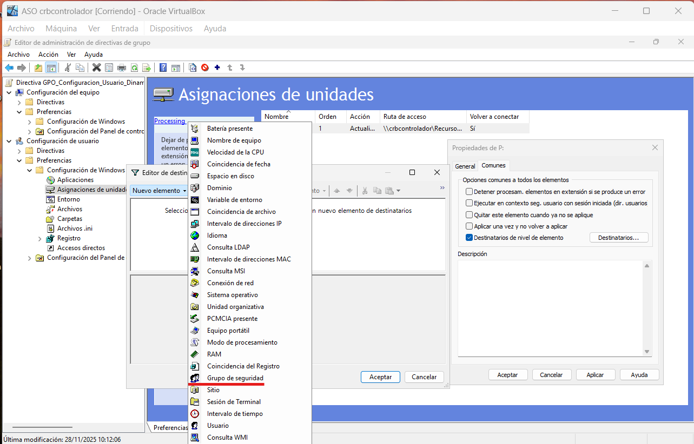

Añadimos el grupo que nos interesa buscándolo con los ... tal que así:

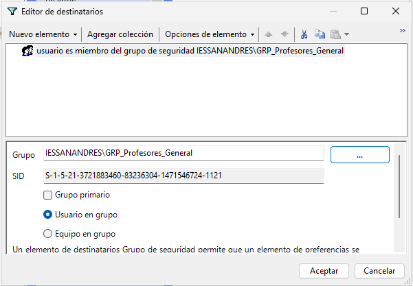

Esto obliga a que el usuario sea miembro del grupo especificado para acceder a Recursos_Profesores (esto es Item-Level Targeting).

Ya estaría todo, aplicamos y aceptamos.

2.2. Accesos Directos (Shortcuts)

El departamento de informática quiere un acceso directo a la Intranet en el escritorio, pero solo para los alumnos del ciclo DAM, ya que son los que están desarrollando la nueva web.

Crea un acceso directo en el Escritorio que apunte a http://intranet.iessanandres.local (puedes inventar la URL).
Requisito: Usa Item-Level Targeting para que este acceso directo SOLO aparezca a los miembros del grupo GRP_Alumnos_DAM.

