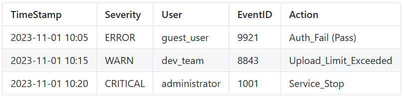
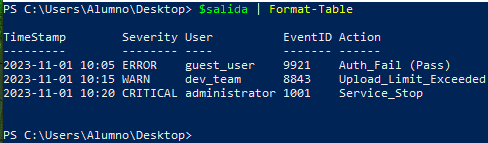

1.- Objetivo

Eres el administrador de sistemas de una empresa de seguridad. Un servidor legacy (antiguo) está generando unos logs de aplicación con un formato terrible y poco estándar. El departamento de seguridad necesita un informe limpio en CSV para poder auditar quién ha accedido al sistema.

No puedes cambiar cómo el servidor genera los logs. Tu única opción es crear un script en PowerShell que “digiera” ese texto crudo y lo transforme en información estructurada.

2.- Datos de entrada
Debes copiar y pegar este bloque de texto en su script dentro de una variable (Heredoc) o leerlo desde un archivo .txt.

```bash
$logCrudo = @"
[INFO] ID:8842 :: 2023/11/01_10:00 :: User:admin_01 :: Action:Login_Success
[ERROR] ID:9921 :: 2023/11/01_10:05 :: User:guest_user :: Action:Auth_Fail (Pass)
[WARN] ID:8843 :: 2023-11-01 10:15 :: User:dev_team :: Action:Upload_Limit_Exceeded
[CRITICAL] ID:1001 :: 01-11-2023_10:20 :: User:ROOT :: Action:Service_Stop
"@
```
Ya tenemos la variable creada leyendo un archivo .txt con el contenido. (logs.txt está en el escritorio)

```bash
PS C:\Users\Alumno> $logCrudo = Get-Content "C:\Users\Alumno\Desktop\logs.txt"
PS C:\Users\Alumno> $logCrudo
[INFO] ID:8842 :: 2023/11/01_10:00 :: User:admin_01 :: Action:Login_Success
[ERROR] ID:9921 :: 2023/11/01_10:05 :: User:guest_user :: Action:Auth_Fail (Pass)
[WARN] ID:8843 :: 2023-11-01 10:15 :: User:dev_team :: Action:Upload_Limit_Exceeded
[CRITICAL] ID:1001 :: 01-11-2023_10:20 :: User:ROOT :: Action:Service_Stop
PS C:\Users\Alumno>
```

Observa bien los datos. Hay inconsistencias deliberadas:

Las fechas tienen formatos distintos (/, -, _).
Los delimitadores principales son ::, pero hay espacios variables.
Los usuarios a veces están en mayúsculas y otras en minúsculas.

3.- Los requisitos

Tu script debe procesar $logCrudo y cumplir estrictamente con los siguientes puntos.

Normalización de fechas: todas las fechas deben salir en formato estándar ISO yyyy-MM-dd HH:mm.

Limpieza de usuarios:

Deben estar todos en minúsculas.

Si el usuario es “ROOT”, debe ser renombrado automáticamente a “administrator” por política de seguridad.

Clasificación de gravedad:

Debes extraer el nivel de log (INFO, ERROR, etc.) sin los corchetes [].

Filtrado:

Solo nos interesan las líneas que NO sean [INFO]. Ignora los logs informativos.

Vamos a hacer todo poco a poco:

```bash
$salida = @()  #Declarar y/o vaciar $salida

foreach ($linea in $logCrudo) {

    $texto = $linea.Trim()
    if ($texto.StartsWith("[INFO]")) { continue }

    $nivel = $texto.Split(" ")[0]
    $nivel = $nivel.TrimStart("[")
    $nivel = $nivel.TrimEnd("]")

    $resto = $texto.Substring($texto.IndexOf("]") + 1).Trim()
    $partes = $resto -split " :: "

    #Saltar líneas mal formadas
    if ($partes.Length -lt 4) { continue }

    $idPart     = $partes[0]
    $fechaPart  = $partes[1]
    $userPart   = $partes[2]
    $actionPart = $partes[3]

    $eventID = $idPart.Split(":")[1].Trim()
    $usuario = $userPart.Split(":")[1].Trim()
    $accion  = $actionPart.Split(":")[1].Trim()

    # Cambiar ROOT por administrator
    if ($usuario -eq "ROOT") { $usuario = "administrator" }

    # Normalizar fecha
    $fechaTexto = $fechaPart -replace "/", "-" -replace "_", " "
    if ($fechaTexto -like "????-??-??*") {
        $fechaNormal = Get-Date $fechaTexto -Format "yyyy-MM-dd HH:mm"
    }
    elseif ($fechaTexto -like "??-??-????*") {
        $partesFecha = $fechaTexto.Split(" ")
        $fecha = $partesFecha[0].Split("-")
        $hora  = $partesFecha[1]
        $fechaReordenada = "$($fecha[2])-$($fecha[1])-$($fecha[0]) $hora"
        $fechaNormal = Get-Date $fechaReordenada -Format "yyyy-MM-dd HH:mm"
    }
    else {
        continue
    }

    $obj = [PSCustomObject]@{
        TimeStamp = $fechaNormal
        Severity  = $nivel
        User      = $usuario
        EventID   = $eventID
        Action    = $accion
    }

    $salida += $obj
}

# Exportar a CSV
$salida | Export-Csv "C:\Users\Alumno\Desktop\final.csv" -NoTypeInformation
```

Ejecutamos y se crea el CSV.

Salida estructurada:

El script no debe escribir texto plano en la consola. Debe generar Objetos PowerShell (PSCustomObject) y finalmente exportarlos a un archivo reporte_seguridad.csv. Para crear esta tabla usa [PSCustomObject]@{}.

4.- Resultado esperado

Al abrir el CSV generado, debería verse algo así (el orden de columnas puede variar):



Ya se ejecutó:

```bash
PS C:\Users\Alumno\Desktop> $salida | Export-Csv -Path "final.csv" -NoTypeInformation
PS C:\Users\Alumno\Desktop>
```

Así es como se me ve el CSV generado:

```bash
PS C:\Users\Alumno\Desktop> $salida | Format-Table

TimeStamp        Severity User          EventID Action
---------        -------- ----          ------- ------
2023-11-01 10:05 ERROR    guest_user    9921    Auth_Fail (Pass)
2023-11-01 10:15 WARN     dev_team      8843    Upload_Limit_Exceeded
2023-11-01 10:20 CRITICAL administrator 1001    Service_Stop


PS C:\Users\Alumno\Desktop>
```

