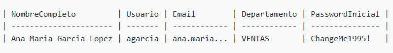

1.- Objetivo

Trabajas como Administrador de Sistemas en la empresa TechIberia S.L.. El departamento de Recursos Humanos utiliza una aplicación antigua para registrar a las nuevas incorporaciones.

Cada lunes, RRHH te envía un fichero de texto plano con los datos de los nuevos empleados. Lamentablemente, el formato de salida de su aplicación es caótico: todo está en mayúsculas, los delimitadores son extraños y los campos están mezclados.

Tu objetivo es crear un script en PowerShell que lea estos datos “sucios”, los procese utilizando manipulación de cadenas y exporte un archivo CSV limpio y profesional listo para ser importado a Active Directory o Microsoft 365.

2. Datos de Entrada
   
Crea un fichero llamado nuevos_empleados_raw.txt con el siguiente contenido exacto (copia y pega):

GARCIA LOPEZ, ANA MARIA|MAD-VENTAS-01|1995/05/12
RUIZ DE LA TORRE, PEDRO|BCN-IT_SOPORTE-02|1988/11/23
O'CONNOR, SARAH JANE|BIO-MARKETING-05|2001/02/15
MARTINEZ, JOSE|SEV-LOGISTICA-09|1999/12/30

He creado el fichero manualmente y la variable para poder usarlo. Además, he comprobado que la variable es un array de líneas con $nuevosempleadosraw[0], $nuevosempleadosraw[1], etc. Resulta que al extraer de un fichero con Get-Content se hace un array de líneas por defecto, así que no habría que usar "`r`n".

```bash
$nuevosempleadosraw = Get-Content -Path C:\ASO\ut06\pr0607\nuevos_empleados_raw.txt

Write-Host "Este es el contenido del archivo"
$nuevosempleadosraw
```

1. Requerimientos técnicos

El script debe leer el fichero línea por línea y realizar las siguientes transformaciones de cadena para cada empleado:

Nombre y apellidos:

El formato original es APELLIDOS, NOMBRE en mayúsculas.

Debes separarlos y convertirlos a Title Case (primera letra mayúscula, resto minúscula).

Ejemplo: “Ana Maria Garcia Lopez”.

Generación de nombre de usuario (SAMAccountName):

Debe formarse con: la primera letra del nombre + las primeras 6 letras del primer apellido.

Todo en minúsculas.

Si el apellido tiene menos de 6 letras, no debe dar error, debe coger las que tenga.

Generación de correo electrónico:

Formato: nombre.apellido@techiberia.com.

Si el nombre o apellido es compuesto, reemplaza los espacios por puntos (ej: ana.maria.garcia.lopez@techiberia.com).

Departamento y ubicación:

El código original es CIUDAD-DEPARTAMENTO-ID.

Debes extraer solo el nombre del departamento (lo que está en el medio).

Debes limpiar el texto (ej: convertir IT_SOPORTE a It Soporte o simplemente IT_SOPORTE, pero sin la ciudad ni el ID).

Contraseña temporal:

Debe ser la palabra ChangeMe + el año de nacimiento + el símbolo !.

Para esto necesitas extraer el año de la fecha proporcionada.

1. Salida Esperada
   
El script debe generar un archivo llamado usuarios_importar.csv que contenga objetos con las siguientes columnas:

