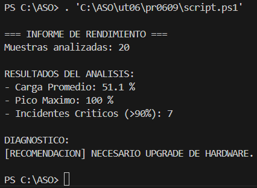

1.- Objetivo

El servidor de base de datos (SRV-SQL-PROD) se ha reiniciado inesperadamente esta madrugada. Tu jefe sospecha que el servidor se está quedando pequeño y que la CPU llegó al 100% provocando el colapso.

El sistema de monitorización ha volcado un array de enteros con el porcentaje de uso de CPU tomado cada 5 minutos durante la última hora crítica.

Tu objetivo será escribir un script que analice esos datos crudos y genere un informe automático para decidir si es necesario comprar más procesadores o si solo fue un error puntual.

2. Datos de Entrada

Copia esta variable en tu script. Representa el % de CPU en intervalos de 5 minutos.

```bash
$muestrasCPU = @(15, 12, 18, 20, 45, 88, 95, 99, 100, 98, 55, 22, 15, 10, 12, 14, 95, 99, 100, 10)
```

1. Requerimientos técnicos

Tu script debe recorrer el array $muestrasCPU y calcular manualmente lo siguiente:

Carga promedio:

Suma todos los valores y divídelos entre la cantidad total de muestras.

Pico máximo:

Debes averiguar cuál fue el valor más alto registrado.

Contador de incidentes críticos:

Cuenta cuántas veces la CPU superó el 90%. Esto indicará la duración del incidente.

Decisión final:

Si el promedio es superior a 70% O hubo más de 3 incidentes críticos, el script debe imprimir: [RECOMENDACIÓN] NECESARIO UPGRADE DE HARDWARE.

En caso contrario: [RECOMENDACIÓN] FALSA ALARMA. EL SERVIDOR AGUANTA.

El script final acabado quedó así:

```bash
$muestrasCPU = @()

$muestrasCPU = @(15, 12, 18, 20, 45, 88, 95, 99, 100, 98, 55, 22, 15, 10, 12, 14, 95, 99, 100, 10)

$suma = 0

$count = $muestrasCPU.Count

$max = 0

$reco = ""

$contador = 0

for ($i = 0; $i -lt $count; $i++) {

    $suma = $suma + $muestrasCPU[$i]

}

$media = ($suma / $count)

for ($i = 0; $i -lt $count; $i++) {

    for ($j = 0; $j -lt $count; $j++) {

        if ($muestrasCPU[$i] -gt $muestrasCPU[$j]) {
            $max = $muestrasCPU[$i]
        }

    }   

}

for ($i = 0; $i -lt $count; $i++) {

    if ($muestrasCPU[$i] -gt 90) {
            $contador++
    }

}

if ($media -gt 70) {
    $reco = "NECESARIO UPGRADE DE HARDWARE."
} elseif ($contador -gt 3) {
    $reco = "NECESARIO UPGRADE DE HARDWARE."
} else {
    $reco = "FALSA ALARMA. EL SERVIDOR AGUANTA."
}

Write-Host "
=== INFORME DE RENDIMIENTO ===
Muestras analizadas: $count

RESULTADOS DEL ANALISIS:
- Carga Promedio: $media %
- Pico Maximo: $max %
- Incidentes Criticos (>90%): $contador

DIAGNOSTICO:
[RECOMENDACION] $reco
"
```

1. Salida Esperada

```bash
=== INFORME DE RENDIMIENTO ===
Muestras analizadas: 20

RESULTADOS DEL ANÁLISIS:
- Carga Promedio: 46.1 %
- Pico Máximo: 100 %
- Incidentes Críticos (>90%): 6

DIAGNÓSTICO:
[RECOMENDACIÓN] NECESARIO UPGRADE DE HARDWARE
```

La salida que me dio fue la siguiente:



--- FORMA ALTERNATIVA CON COMANDOS NATIVOS DE POWERSHELL ---

```bash
# 1. Definición de la colección de datos
$muestrasCPU = @(15, 12, 18, 20, 45, 88, 95, 99, 100, 98, 55, 22, 15, 10, 12, 14, 95, 99, 100, 10)

# 2. Uso de Measure-Object (Cálculo de estadísticas)
# Este comando procesa la lista y genera un objeto con los resultados
$estadisticas = $muestrasCPU | Measure-Object -Average -Maximum

# 3. Uso de Where-Object (Filtrado de datos críticos)
# Filtramos los valores mayores a 90 y contamos cuántos elementos resultan
$picosCriticos = ($muestrasCPU | Where-Object -FilterScript { $PSItem -gt 90 }).Count

# 4. Asignación de variables desde las propiedades del objeto resultante
$media   = $estadisticas.Average
$maximo  = $estadisticas.Maximum
$conteo  = $estadisticas.Count

# 5. Evaluación de la lógica de negocio
# Usamos operadores lógicos completos (-or)
if ($media -gt 70 -or $picosCriticos -gt 3) {
    $recomendacion = "NECESARIO UPGRADE DE HARDWARE."
} else {
    $recomendacion = "FALSA ALARMA. EL SERVIDOR AGUANTA."
}

# 6. Salida de datos formateada
Write-Host "=== INFORME DE RENDIMIENTO NATIVO ==="
Write-Host "Muestras analizadas: $conteo"
Write-Host ""
Write-Host "RESULTADOS DEL ANÁLISIS:"
Write-Host "- Carga Promedio: $media %"
Write-Host "- Pico Máximo: $maximo %"
Write-Host "- Incidentes Críticos (>90%): $picosCriticos"
Write-Host ""
Write-Host "DIAGNÓSTICO:"
Write-Host "[RECOMENDACIÓN] $recomendacion"
```