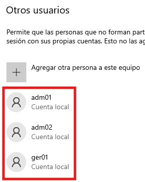
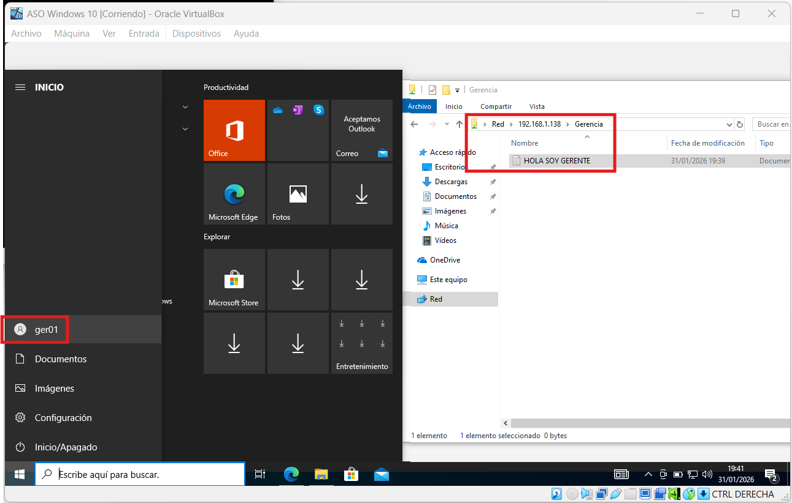
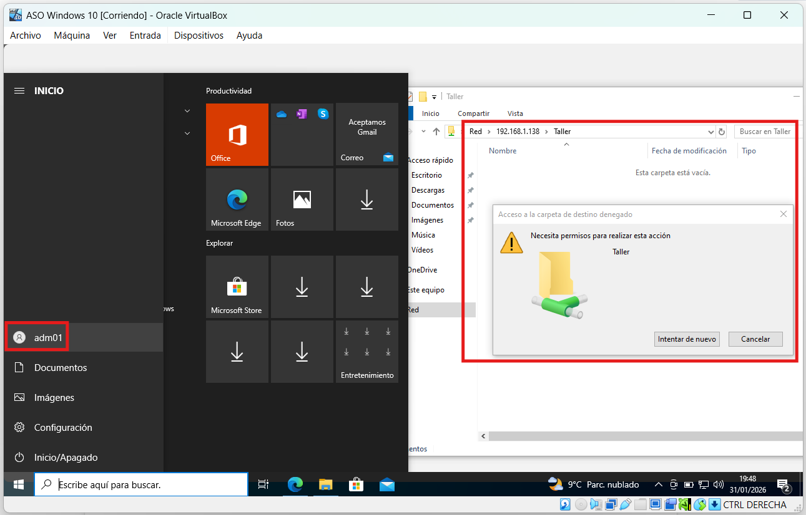
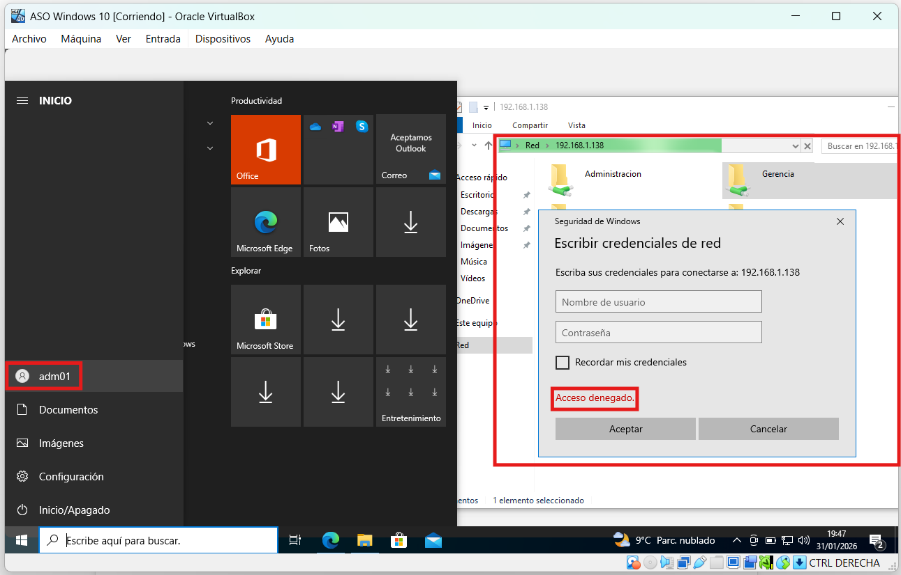
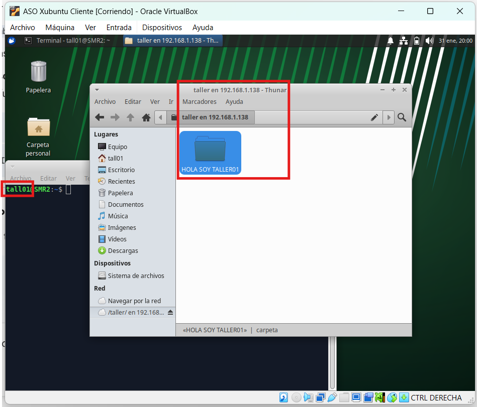
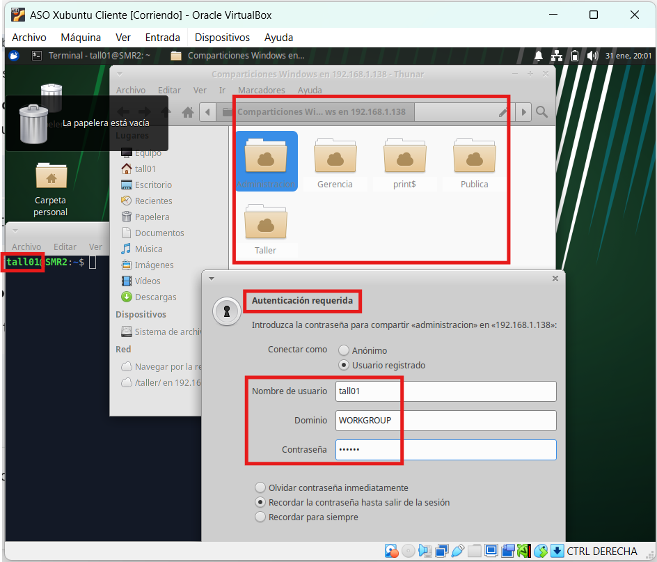
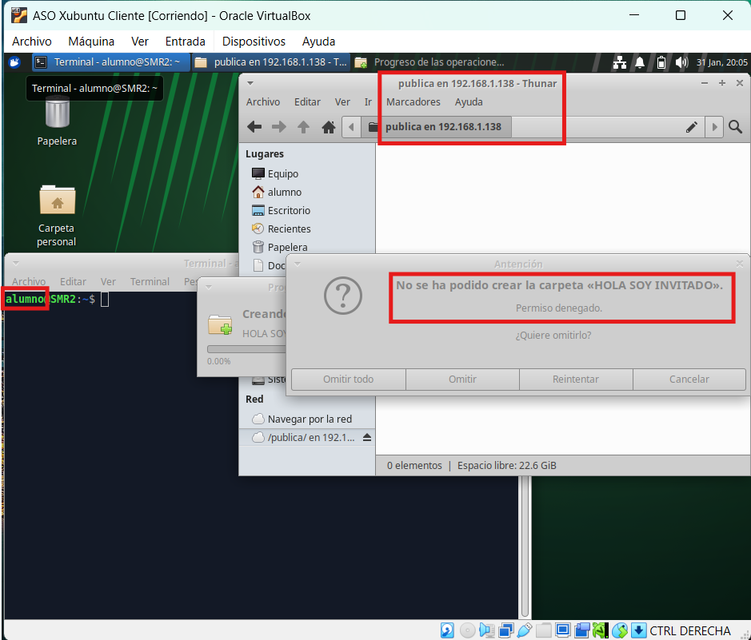

En esta práctica vamos a trabajar con carpetas compartidas en Linux mediante Samba preparando una infraestructura de red para una empresa:

Las IPs de mi Xubuntu Server, de mi W10, y de mi Xubuntu Cliente son, respectivamente:

```bash
192.168.1.138
192.168.1.140
192.168.1.141
```

Tras desactivar el firewall en W10 hacen ping entre todas las máquinas bien.

Vamos a suponer que queremos compartir 4 carpetas:

Gerencia
Administración
Taller
Pública

Hacemos:

```bash
sudo apt update
sudo apt install samba
```

Y creamos las carpetas tal que así:

```bash
mkdir /samba_compartidos
cd /samba_compartidos
mkdir Gerencia
mkdir Administracion
mkdir Taller
mkdir Publica
```

Por otro lado, la empresa tendrá 6 empleados: ger01, adm01, adm02, tall01, tall02 y tall03.

Vamos a crear los usuarios y los grupos, asignamos grupos a los usuarios y los añadimos a Samba con los siguientes comandos:

```bash
addgroup grupo_adm
addgroup grupo_tall
```

```bash
adduser ger01

adduser adm01
adduser adm02
usermod -aG grupo_adm adm01
usermod -aG grupo_adm adm02

adduser tall01
adduser tall02
adduser tall03
usermod -aG grupo_tall tall01
usermod -aG grupo_tall tall02
usermod -aG grupo_tall tall03
```

```bash
smbpasswd -a ger01
smbpasswd -a adm01
smbpasswd -a adm02
smbpasswd -a tall01
smbpasswd -a tall02
smbpasswd -a tall03
```

La contraseña de Linux y de Samba de todos los usuarios es la misma: alumno.

Estas carpetas serán accesibles por los siguientes usuarios según los siguientes criterios:

-Todos los empleados podrán acceder a la carpeta Pública con permisos de lectura, mientras que el empleado ger01 podrá hacerlo con permisos de lectura y escritura. 

-El empleado ger01 podrá acceder con todos los permisos a la carpeta Gerencia. 

-Los empleados adm01 y adm02 tendrán acceso con todos los permisos a Administración y con permisos de lectura únicamente a la carpeta Taller.

-Por último, los usuarios tall01, tall02 y tall03 tendrán acceso de lectura y escritura a la carpeta Taller.

-Finalmente, cualquier usuario que no sea uno de los anteriores (invitado) podrá acceder únicamente a la carpeta Pública.

Hacemos nano /etc/samba.conf y al final del fichero añadimos todas las especificaciones:

```bash
[Gerencia]
   path = /samba_compartidos/Gerencia
   browseable = yes
   read only = no
   valid users = ger01

[Administracion]
   path = /samba_compartidos/Administracion
   browseable = yes
   read only = no
   valid users = @grupo_adm

[Taller]
   path = /samba_compartidos/Taller
   browseable = yes
   writable = yes
   write list = @grupo_tall
   read list = @grupo_adm
   valid users = @grupo_tall, @grupo_adm

[Publica]
   path = /samba_compartidos/Publica
   browseable = yes
   guest ok = yes
   write list = ger01
   read only = yes
```

Tras comprobar que lo tenemos bien con el testparm, ahora vamos a dar permisos necesarios para que todo funcione.

También nos aseguramos que el propietario sea root:

```bash
sudo chown ger01:root /samba_compartidos/Gerencia
sudo chmod 700 /samba_compartidos/Gerencia

sudo chown root:grupo_adm /samba_compartidos/Administracion
sudo chmod 770 /samba_compartidos/Administracion

sudo chown root:grupo_tall /samba_compartidos/Taller
sudo chmod 775 /samba_compartidos/Taller

sudo chmod 777 /samba_compartidos/Publica
```

Algunas cuestiones que tienes que tener en cuenta:

-Utiliza grupos para agrupar usuarios.

-Crea una carpeta común dentro de la cual estarán todas las carpetas compartidas.

-Recuerda que el propietario de las carpetas compartidas es root y el grupo propietario aquel que vaya a tener permisos.

-Para asignar diferentes tipos de permisos a diferentes usuarios en la misma carpeta debes usar los parámetros read list y write list del fichero smb.conf.

Los usuarios ger01, adm01 y adm02 utilizarán máquinas Windows, por lo que créalos en un Windows de escritorio que tengas y verifica que funcionan.
El resto de los usuarios usan Linux, por lo que debes crearlos en otra máquina Linux y prueba el acceso desde ella.

Para la entrega de la práctica debes documentar todos los pasos realizados.

VOY A MOSTRAR ALGUNAS DE LAS ESPECIFICACIONES FUNCIONANDO CORRECTAMENTE:

En W10, agregamos ger01, adm01 y adm02 como usuarios locales para entrar como ellos y probar lo configurado conectándonos a la IP del Xubuntu Server.

Para agregarlos en W10 lo hicimos en Configuración > Cuentas > Otros usuarios > Agregar otra persona a este equipo.



Para ger01:

Puede leer y escribir en Gerencia.



Para adm01 (es igual que adm02):

Puede entrar en Taller con sólo lectura.



No puede entrar en Gerencia.



En Xubuntu Cliente, agregamos tall01, tall02 y tall03 como usuarios locales para entrar como ellos y probar lo configurado conectándonos a la IP del Xubuntu Server.

Para agregarlos en Xubuntu Cliente lo hicimos de la siguiente manera:

```bash
sudo adduser tall01
sudo adduser tall02
sudo adduser tall03
```

Para tall01 (es igual que los otros dos):

Puede leer y escribir en Taller.



No puede entrar en Administracion.



Para el invitado (Entramos con la cuenta que traía por defecto el Xubuntu Cliente: alumno):

Puede entrar en Publica.

